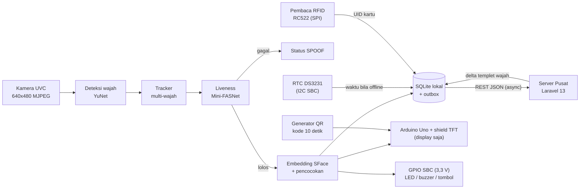
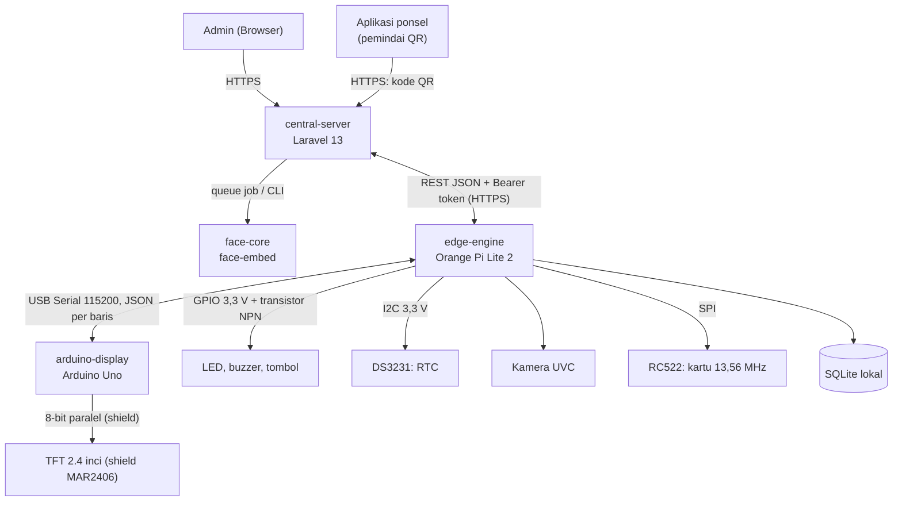

# PRD — Sistem Absensi "Smart Absensi"
## Product Requirement Document (PRD) — Monorepo

> **Versi**: 2.4.0
> **Tanggal**: 2026-10-06
> **Status**: Draft — Menunggu Review
> **Penulis**: Tim Smart Absensi
> **Repositori**: `d:\Github\absensi-cam`

---

## Daftar Isi

1. [Executive Summary & Arsitektur Sistem](#1-executive-summary--arsitektur-sistem)
2. [Package Structure](#2-package-structure)
3. [Bill of Materials (BOM) Detail](#3-bill-of-materials-bom-detail)
4. [Pinout & Interconnection Detail](#4-pinout--interconnection-detail)
5. [Power Consumption Budget & Battery Runtime](#5-power-consumption-budget--battery-runtime)
6. [Thermal Management & Reliability](#6-thermal-management--reliability)
7. [Constraint, Risiko & Mitigasi Hardware](#7-constraint-risiko--mitigasi-hardware)
8. [Roadmap Hardware V2 — Fabrikasi PCB & Casing](#8-roadmap-hardware-v2--fabrikasi-pcb--casing)
9. [Acceptance Criteria & Checklist Validasi](#9-acceptance-criteria--checklist-validasi)
10. [Requirement Perangkat Lunak](#10-requirement-perangkat-lunak)
11. [Model Data & Kontrak API](#11-model-data--kontrak-api)
12. [Keamanan, Privasi & Kepatuhan](#12-keamanan-privasi--kepatuhan)
13. [Asumsi & Pertanyaan Terbuka](#13-asumsi--pertanyaan-terbuka)
14. [Rencana Implementasi & Milestone](#14-rencana-implementasi--milestone)
- [Lampiran](#lampiran)

---

## 1. Executive Summary & Arsitektur Sistem

### 1.1 Tujuan Dokumen

Dokumen ini adalah **Product Requirement Document (PRD)** untuk monorepo **"Smart Absensi"** — sistem absensi berbasis *face recognition* yang berjalan **offline-first** pada terminal edge murah (Orange Pi Lite 2) dan terhubung ke **Server Pusat Laravel 13** untuk manajemen anggota, sinkronisasi templet wajah, laporan, dan audit.

Dokumen ini mendefinisikan:

- **Apa** yang harus dibangun (fitur, batasan, target kinerja terukur),
- **Bagaimana** komponen saling berkomunikasi (hardware, firmware, engine edge, server pusat),
- **Bagaimana** sistem divalidasi (Acceptance Criteria pada Bagian 9).

**Pembaca sasaran**: engineer hardware/firmware, developer C++ dan Laravel, penguji QA, serta pemangku kepentingan sekolah/perusahaan.

**Hubungan dengan Facenox**: [Facenox](https://github.com/facenox/facenox) digunakan sebagai **referensi konsep dan pembanding**, bukan basis kode. Facenox berlisensi **AGPL-3.0**; jika ada kode Facenox yang disalin/diturunkan, seluruh produk turunan wajib mengikuti AGPL-3.0 (lihat Bagian 12.4).

**Hubungan dengan SekolahKita.net**: Proyek ini bagian dari ekosistem SekolahKita.net (CV Watulintang Media). Terminal ini adalah perangkat keras "Mesin Presensi Terintegrasi" yang tercantum di halaman publik SekolahKita tetapi **belum tersedia**; yang dibangun di sini adalah mesin tersebut. Arah integrasi dengan platform SekolahKita (sinkronisasi data siswa/kelas, aplikasi ponsel) belum diputuskan (Q10, Q11).

### 1.2 Lingkup Proyek & Keunggulan Kompetitif

**Dalam lingkup (In Scope)**

- Terminal absensi edge: kamera UVC, engine C++ (deteksi, tracking, liveness, pengenalan), display TFT, LED/buzzer/tombol, baterai cadangan, pembaca kartu RFID 13,56 MHz (RC522), dan QR dinamis pada TFT sebagai metode presensi cadangan.
- Metode presensi V1: **wajah** (utama), **kartu RFID**, dan **QR dinamis** (dipindai dari aplikasi ponsel yang terautentikasi; verifikasi di Server Pusat).
- Server Pusat Laravel 13: manajemen sekolah/gedung/perangkat/anggota, enrollment wajah, sinkronisasi templet, penyimpanan riwayat absensi, laporan (Excel/PDF/CSV), audit log.
- Sinkronisasi dua arah edge <-> server via REST API / JSON.

**Di luar lingkup (Out of Scope) untuk rilis ini**

- Aplikasi desktop Electron seperti Facenox (tidak layak pada RAM 1 GB; fungsinya dipindahkan ke Web Admin Laravel dan layar sentuh TFT).
- Aplikasi mobile (pemindai QR di aplikasi SekolahKita berada di luar repo ini; di sini hanya disediakan endpoint verifikasi), integrasi payroll langsung (hanya ekspor CSV), sensor IR/3D, sidik jari, telapak tangan.
- Sertifikasi biometrik formal (mis. ISO/IEC 30107-3).

**Perbandingan** *(angka Smart Absensi adalah **target desain** yang wajib divalidasi lewat Bagian 9; data pembanding berasal dari dokumentasi publik/brosur dan belum diverifikasi independen — jangan dipakai di materi eksternal sebelum diverifikasi)*

| Aspek | Smart Absensi (Proyek Kita) | Facenox / Fingerspot DT-12MQ | Catatan |
|-------|-----------------------------|------------------------------|---------|
| **Anti-Spoofing** | Model liveness ONNX ringan (Mini-FASNet, ~600 KB), berjalan on-device | Facenox: ONNX liveness; DT-12MQ: sensor IR | Menekan serangan foto cetak/layar HP tanpa sensor IR. Bukan jaminan mutlak; target APCER/BPCER di AC-33 |
| **Jarak Absensi** | Deteksi & tracking hingga 3 m; identifikasi andal 0.5–1.5 m (640x480) atau hingga 3 m (720p, lihat 10.1) | DT-12MQ: ~0.3–0.8 m, subjek berhenti | Wajah pada 3 m di 640x480 hanya ~30 px lebar — terlalu kecil untuk identifikasi andal |
| **Kapasitas Pemindaian** | 3–5 wajah dalam frame; pengenalan dijalankan **per-track**, bukan per-frame | DT-12MQ: satu wajah berurutan | Embedding hanya diekstrak pada frame terpilih (maks. 5 per track) sampai identitas terkonfirmasi, lalu dihentikan untuk track itu |
| **Kecepatan Engine** | Deteksi < 30 ms (input 320x240); keputusan end-to-end < 3 s (target tipikal < 1.5 s) | Facenox: FastAPI/Electron di PC | Target internal, belum terukur di OPi Lite 2 |
| **Memori** | RSS engine < 150 MB (target) | Facenox: Electron + Python (lebih besar) | Model SFace berukuran puluhan MB; batas ini realistis untuk RAM 1 GB |
| **Target Hardware** | Orange Pi Lite 2 (ARM SBC, ~US$25) | PC / laptop | Hemat daya dan biaya |
| **Server Pusat** | Laravel 13 — REST API / JSON, self-hosted | Facenox Dashboard (cloud) / proprietary | Data tetap di infrastruktur sendiri |
| **Sinkronisasi** | REST API JSON, idempotent, offline-queue | Proprietary / tidak ada | Standar dan audit-friendly |
| **Metode Presensi** | Wajah (utama), kartu RFID 13,56 MHz, QR dinamis di TFT | Facenox: wajah; DT-12MQ: wajah, kartu RFID 13,56 MHz, PIN, QR | Sidik jari/telapak tangan tidak ada di V1. Keunggulan hanya boleh diklaim setelah AC-48..AC-56 lulus |
| **Daya Cadangan** | UPS 18650 (target ≥ 2 jam, AC-06a) | DT-12MQ: tanpa baterai cadangan (spesifikasi vendor) | Keunggulan berlaku bila *switchover* dan runtime terbukti (AC-05, AC-06a) |

### 1.3 Alur Kerja Sistem



**Narasi Alur:**

1. **Power ON**: Adaptor 5V/4A menyuplai modul UPS 18650 (charger + boost). Modul UPS mendistribusikan 5V ke SBC dan Arduino.
2. **Boot SBC**: Orange Pi Lite 2 boot dari MicroSD dalam **< 45 detik** hingga service systemd `smart-absensi.service` (Engine C++) berstatus `active (running)`.
3. **Sinkronisasi Waktu**: Engine membaca waktu dari RTC DS3231 (I2C pada SBC, 3,3 V) bila jaringan belum tersedia; NTP mengoreksi setelah jaringan aktif. Setiap record menyimpan `time_source` (`ntp` / `rtc` / `unsynced`).
4. **Init Camera**: Kamera UVC (`/dev/video0`) diinisialisasi pada 640x480 @ 30 FPS format MJPEG (resolusi dapat dinaikkan ke 720p, lihat 10.1).
5. **Deteksi & Tracking Multi-Wajah**: YuNet mendeteksi wajah hingga jarak 3 m; tracker memberi ID stabil pada tiap wajah.
6. **Liveness & Anti-Spoofing**: Setiap track diverifikasi model Mini-FASNet ONNX. Keputusan diambil dari **beberapa frame** (mis. ≥ 3 dari 5 frame lolos) untuk mengurangi kesalahan tunggal-frame. Track yang gagal ditandai `SPOOF`.
7. **Feature Matching & Logging**: Track yang lolos liveness diekstrak embedding ArcFace (512-d) pada frame terpilih (maks. 5 per track) lalu dicocokkan ke templet di memori (dimuat dari SQLite; **kapasitas ≥ 2000 wajah**). Identitas dikonfirmasi bila skor melewati threshold pada ≥ 3 frame berturut-turut. Hasil ditulis ke tabel `attendance` dan `outbox` dalam satu transaksi.
8. **Feedback Output**: Perintah JSON dikirim ke Arduino Uno via USB Serial hanya untuk TFT; LED dan buzzer digerakkan langsung oleh engine lewat GPIO SBC (lewat transistor NPN). Semua output GPIO OFF saat boot (AC-19a).
9. **REST API Sync**: Worker terpisah mengirim isi `outbox` ke Server Pusat secara asynchronous (batch, idempotent, retry dengan backoff). Server Pusat menyimpan riwayat dan menyediakan laporan terpusat. Perubahan templet wajah ditarik oleh edge secara berkala (delta sync).

**Metode presensi cadangan (V1):**

- **Kartu RFID**: Engine membaca UID kartu 13,56 MHz lewat RC522 (SPI), mencari anggota dari tabel `member_cards` lokal (hasil delta sync), lalu menulis record `method=card` ke `attendance` dan `outbox` dengan cooldown yang sama (FR-E07). Feedback LED/buzzer/TFT sama seperti pengenalan wajah. UID hanya mengidentifikasi, tidak mengotentikasi: kartu dapat dipinjamkan atau digandakan (R28).
- **QR dinamis**: Saat standby, TFT menampilkan kode QR yang berganti tiap 10 detik. Kode dihitung engine dari `qr_secret` perangkat dan waktu (RTC/NTP) dengan skema mirip TOTP. Siswa memindainya dari aplikasi ponsel yang sudah login; **aplikasi mengirim kode ke Server Pusat**, yang memverifikasi dan membuat record `method=qr` (FR-S15). Terminal tidak mengetahui siapa yang memindai, sehingga tidak ada konfirmasi nama di TFT; konfirmasi tampil di aplikasi ponsel. QR tetap valid saat terminal offline karena server menghitung ulang kode dari rahasia yang sama, tetapi ponsel harus punya internet.

### 1.4 Objektif

| Fitur Utama | Deskripsi Spesifikasi Teknikal | Target Objektif |
|-------------|--------------------------------|-----------------|
| **Web Admin Panel (Laravel 13)** | Manajemen anggota, enrollment wajah, sekolah, perangkat, laporan, dan backup melalui browser (menggantikan aplikasi desktop Electron). | Kontrol penuh dari PC admin tanpa instal aplikasi |
| **Kapasitas ≥ 2000 Wajah** | Templet ArcFace 512-d (float32 = 2048 byte/wajah; 2000 wajah ≈ 1 MB) dimuat ke RAM; pencarian *brute-force cosine*. Penyimpanan persisten di SQLite. | Lookup < 50 ms untuk 2000 wajah (AC-32) |
| **Connected Devices** | Heartbeat tiap 60 detik (suhu SoC, RAM, disk, FPS, versi firmware, panjang antrean outbox). Perangkat dianggap *offline* bila tidak ada heartbeat > 3 menit. | Monitoring status perangkat hampir real-time |
| **Custom Branches / Locations** | Perangkat dikelompokkan berdasarkan gedung/gedung/pintu (mis. Gerbang Utama, Pintu Utara, Gedung Bandung). | Manajemen lokasi absensi multi-titik |
| **Custom Organizations** | Hirarki sekolah -> divisi/departemen/kelas -> anggota. | Pengelompokan data pengguna fleksibel |
| **Remote Face Template Sync** | Enrollment satu kali di server; templet (vektor embedding, bukan foto) didistribusikan ke perangkat yang berhak melalui delta sync REST API, termasuk *tombstone* untuk penghapusan. | Registrasi sekali, berlaku di semua lokasi |
| **Riwayat Absensi Terpusat** | Riwayat dari SQLite lokal disinkronkan asynchronous ke Laravel 13; retensi mengikuti kebijakan (Bagian 12.3). | Data terpusat, dapat diakses aman dari mana saja |
| **Audit Logs** | Pencatatan pendaftaran/penghapusan wajah, perubahan hak akses, status perangkat, dan kesalahan sistem; *append-only*. | Jejak audit operasional |
| **Laporan DTR Excel & PDF** | Laporan Daily Time Record harian/bulanan format **.xlsx** dan **PDF**. | Siap cetak untuk rekapitulasi |
| **Ekspor CSV Mentah** | Ekspor data mentah absensi untuk HRMS/Payroll eksternal. | Interoperabilitas tinggi |
| **Presensi Kartu RFID & QR Dinamis** | Kartu RFID 13,56 MHz (RC522) dan QR berganti tiap 10 detik di TFT sebagai metode cadangan bila wajah gagal atau tidak tersedia; setiap record menyimpan `method` (`face`/`card`/`qr`). | Siswa tanpa ponsel tetap bisa presensi lewat kartu; tanpa kartu lewat QR |

---

## 2. Package Structure

Monorepo dibagi menjadi paket-paket yang dapat dibangun dan diuji terpisah.

```text
absensi-cam/
├── apps/
│   ├── central-server/      # Laravel 13: Web Admin + REST API + laporan + queue worker + kartu RFID/verifikasi QR
│   └── edge-engine/         # C++17: pipeline kamera -> deteksi -> liveness -> match, sync worker, serial bridge, pembaca RFID, generator QR
├── firmware/
│   └── arduino-display/     # Arduino Uno + shield: render TFT (termasuk QR); display saja (tanpa LED/buzzer/tombol/RTC)
├── packages/
│   ├── face-core/           # Pustaka C++ bersama (YuNet, SFace, Mini-FASNet); dibangun untuk ARM64 (edge) dan x86_64/ARM64 (server)
│   ├── protocol/            # Skema JSON serial + OpenAPI REST (sumber kebenaran tunggal)
│   └── models/              # File .onnx + checksum SHA-256 + MODEL_VERSION (Git LFS)
├── hardware/                # Skema, KiCad (V2), desain casing
├── deploy/                  # Unit systemd, skrip provisioning, konfigurasi image SD card
├── docs/
└── PRD.md
```

| Package | Bahasa / Stack | Tanggung Jawab | Berjalan Di |
|---------|----------------|----------------|-------------|
| `apps/central-server` | PHP 8.3+ (Laravel 13), MySQL/PostgreSQL, Redis | Admin, API, enrollment, kartu RFID, verifikasi QR, laporan, audit | Server pusat (PC admin/VPS) |
| `apps/edge-engine` | C++17, OpenCV, ONNX Runtime/OpenCV DNN, SQLite | Pengenalan wajah real-time, pembaca RFID (SPI), LED/buzzer/tombol (GPIO), RTC (I2C), generator QR, outbox, sync, serial | Orange Pi Lite 2 |
| `firmware/arduino-display` | C++ (Arduino) | Render TFT shield 8-bit paralel (termasuk QR); touch opsional | Arduino Uno |
| `packages/face-core` | C++17 | Logika model bersama agar embedding identik di edge dan server | Edge + server |
| `packages/protocol` | JSON Schema / OpenAPI 3 | Kontrak antar-komponen | — |
| `packages/models` | ONNX | Model + versi | Edge + server |

> **Prinsip penting — konsistensi model.** Embedding dari model/versi berbeda **tidak kompatibel**. Setiap templet menyimpan `model_version`; edge menolak templet dengan versi berbeda dan meminta re-enrollment/re-embedding. Enrollment di server menggunakan `face-core` yang sama dengan edge.
>
> **Catatan Laravel.** PHP tidak dapat menjalankan inferensi ONNX/OpenCV secara praktis. Laravel memanggil `face-core` (CLI `face-embed`) lewat *queue job* untuk mengekstrak embedding dari foto enrollment; foto **dihapus segera** setelah embedding dibuat.

### Alur Komunikasi Antar Package



| Jalur | Protokol | Arah | Isi |
|-------|----------|------|-----|
| Edge <-> Arduino | USB Serial JSON (4.1) | dua arah | Perintah tampil dan QR; `ack`/`pong`/`ready` (display saja) |
| Edge -> LED/buzzer, tombol -> Edge | GPIO 3,3 V (libgpiod) | dua arah | Output LED/buzzer lewat transistor NPN; input tombol (4.4) |
| Edge <-> DS3231 | I2C 3,3 V (`/dev/i2c-*`) | dua arah | Baca/tulis waktu RTC (4.3) |
| Edge -> Server | HTTPS REST JSON | upload | Batch absensi, heartbeat, log perangkat |
| Server -> Edge | HTTPS REST JSON | download | Delta templet wajah, konfigurasi, tombstone |
| Server -> face-core | Proses lokal (CLI) | satu arah | Foto enrollment -> embedding |
| Edge <-> RC522 | SPI 3,3 V (`/dev/spidev*`) | edge membaca | UID kartu (4.8) |
| Edge -> Arduino | USB Serial JSON (`qr`, 4.1) | satu arah | Payload QR berganti tiap 10 detik |
| Ponsel -> Server | HTTPS REST JSON | upload | Kode QR hasil pindai (`POST /attendance/qr`) |

---

## 3. Bill of Materials (BOM) Detail

### 3.1 Tabel BOM Lengkap

| No | Komponen | Part Number / Model | Qty | Fungsi Utama | Vcc (V) | I Max (mA) | Interface | Catatan |
|----|----------|---------------------|-----|--------------|---------|------------|-----------|---------|
| 1 | SBC Utama | Orange Pi Lite 2 | 1 | Main processing unit | 5.0 | 2000 | USB, header 26-pin, WiFi, HDMI | Allwinner H6 Quad-core Cortex-A53 @1.8GHz, 1GB LPDDR3. **Hanya 2 port USB host** (1x USB 3.0, 1x USB 2.0) + 1x micro-USB OTG (juga input daya) |
| 2 | Camera USB | UVC Mini USB Web Camera | 1 | Capture wajah | 5.0 (VBUS) | 500 | USB 2.0 (UVC) | Plug & Play (`/dev/video0`); wajib mendukung MJPEG 640x480 @ 30 FPS; disarankan 720p untuk jarak jauh |
| 3 | Display | LCD Wiki 2.4" Arduino Shield MAR2406 (parallel) | 1 | Status absensi, nama, waktu | 5.0 | 120 | 8-bit parallel | Driver ILI9341 (vendor; varian ST7789V dijual terpisah); 320×240 px; touch resistif opsional (tipe dan pin belum terdokumentasi). Shield langsung di atas Arduino Uno; memakai hampir semua pin Uno (4.2). **Pustaka Adafruit SPI tidak berlaku**; gunakan pustaka vendor/`MCUFRIEND_kbv` dan cek `readID()` |
| 4 | Storage | MicroSD 16GB (min. 8GB), A1 / high-endurance | 1 | OS, service, database lokal | 3.3 | 100 | SDIO | Class 10 minimum; SanDisk/Samsung Endurance direkomendasikan |
| 5 | MCU | Arduino Uno (ATmega328P) | 1 | Terminal display: driver TFT shield; bridge serial ke SBC | 5.0 | 500 | USB-B Serial | ATmega328P @16MHz, SRAM 2 KB. **Tidak** menangani LED, buzzer, tombol, atau RTC (dipindah ke SBC) |
| 7 | Adaptor | Adaptor DC 5V/4A | 1 | Sumber daya utama dari 220V AC | Out: 5.0 | 4000 | DC Barrel 5.5x2.1mm | Ripple < 50mV; beban puncak + charging ≈ 3.3A sehingga 5V/3A tidak cukup |
| 8 | Ethernet (opsional) | USB-to-Ethernet RTL8153 + UTP Cat5e/Cat6 3m | 1 set | Koneksi kabel ke LAN | - | ~300 | USB 3.0 / RJ45 | Butuh port USB tambahan -> perlu **hub USB berdaya** (No 16). Jaringan utama V1 adalah **WiFi 802.11ac** |
| 9 | Modul UPS | Modul UPS 18650 (charger + boost 5V, ≥ 3A) | 1 | Charging baterai + output 5V saat AC putus | In/Out: 5.0 | 3000 | Passthrough | Gunakan boost berbasis XL6009 atau setara ≥ 3A. **MT3608 tidak direkomendasikan** (batas 2A). Proteksi over-charge 4.2V, over-discharge 3.0V; switchover < 100ms |
| 10 | Baterai | Li-Ion 18650 ≥ 2500 mAh (NCR18650B / Samsung 25R / LG MH1) | 2 (min) – 4 (rekomendasi) | Daya cadangan | 3.7 nominal | ≥ 2C | Slot UPS (paralel) | 2 sel ≈ 2.5 jam, 4 sel ≈ 5 jam (lihat 5.2) |
| 11 | LED Indikator | LED 5mm (Hijau, Merah) | 2 | Success, Fail | 5.0 | 10 per LED | GPIO SBC 3,3 V -> transistor NPN -> LED (pin ditetapkan setelah verifikasi) | Resistor seri 330 Ω; LED disuplai rail 5 V lewat transistor sehingga arus tidak melalui pin GPIO; output default OFF saat boot |
| 12 | Buzzer | Piezo Buzzer Aktif 5V | 1 | Feedback audio | 5.0 | 30 | GPIO SBC 3,3 V -> transistor NPN (pin ditetapkan setelah verifikasi) | Buzzer aktif (osilator internal ~2.4kHz); SPL ≥ 85dB @10cm; disuplai rail 5 V lewat transistor, **bukan** dari pin GPIO; dioda flyback tidak perlu untuk piezo aktif, tetapi pasang resistor basis (mis. 1 kΩ, nilai awal) |
| 13 | Tombol Tactile | Push Button 6x6mm | 1 | Trigger manual absensi | 3.3 | < 1 | GPIO SBC 3,3 V (pin ditetapkan setelah verifikasi) | SPST NO ke GND dengan pull-up ke 3,3 V; debounce software 20 ms di engine. **Jangan memberi 5 V ke pin GPIO** |
| 14 | RTC | Modul RTC DS3231 (+ baterai CR2032) | 1 | Waktu akurat saat offline (OPi Lite 2 tidak punya RTC) | **3.3** | < 1 | I2C (0x68) pada bus I2C SBC | **Daya 3,3 V, bukan 5 V**: pull-up onboard modul (mis. ZS-042) ke 5 V dapat memasukkan 5 V ke pin SBC. Ketersediaan `/dev/i2c-*` pada image Buster belum diverifikasi (R21) |
| 15 | Heat sink | Aluminium ≥ 14x14mm + thermal pad | 1 | Pendingin SoC H6 | - | - | - | Wajib (lihat 6.2) |
| 16 | Hub USB (opsional) | Hub USB 2.0/3.0 berdaya | 1 | Menambah port bila memakai Ethernet | 5.0 | - | USB | Wajib jika dongle Ethernet dipakai bersama kamera + Arduino |
| 17 | Komponen pasif | Kapasitor 1000µF/10V + 100µF; resistor 330Ω x2 (LED), 1kΩ x3 (basis transistor), 4.7kΩ (pull-up tombol/I2C bila perlu) | 1 set | Stabilisasi rail 5V dan driver GPIO | - | - | - | Kapasitor bulk untuk mitigasi R01; pull-up I2C hanya bila modul RTC tidak memilikinya, ke 3,3 V |
| 18 | Pembaca RFID | RC522 (MFRC522, 13,56 MHz) + kartu/tag MIFARE 13,56 MHz | 1 modul + kartu uji | Presensi kartu (metode cadangan) | 3.3 | ~30 | SPI (3,3 V) ke header 26-pin SBC | Modul sudah dimiliki. **Hanya 3,3 V**: 5 V merusak pin SBC. Pin header dan ketersediaan `/dev/spidev*` pada image Buster belum diverifikasi (R24). Hanya UID yang dibaca; data sektor kartu tidak dipakai |
| 19 | Transistor NPN | NPN signal kecil (mis. 2N2222A/BC547) | 3 | Driver buzzer, LED hijau, LED merah dari GPIO | 5.0 (beban) | ≤ 100 per kanal | GPIO SBC 3,3 V ke basis lewat resistor | Jenis dan resistor basis adalah nilai awal; verifikasi arus basis dan tegangan saturasi pada 3,3 V saat komisioning (R22) |

### 3.2 Spesifikasi Hardware SBC & Kamera

| Parameter | Spesifikasi |
|-----------|-------------|
| SBC Model | Orange Pi Lite 2 (Allwinner H6 Quad-Core Cortex-A53 @ 1.8 GHz) |
| RAM | 1GB LPDDR3 (dibagi dengan GPU) |
| Port USB | 1x USB 3.0 Host, 1x USB 2.0 Host, 1x micro-USB OTG (juga input daya) |
| Header | 26-pin (dipakai di V1 untuk RC522 via SPI (4.8), LED/buzzer/tombol via GPIO (4.4), dan DS3231 via I2C (4.3); komunikasi ke Arduino lewat USB; **nomor pin belum ditetapkan**, verifikasi dahulu) |
| Camera Input | USB Web Camera UVC driverless via USB 2.0/3.0 |
| Network | WiFi onboard AP6255 (802.11 a/b/g/n/ac) + Bluetooth 4.1; Ethernet hanya lewat dongle USB |
| Operating System | Image resmi Orange Pi Debian Buster |

---

## 4. Pinout & Interconnection Detail

### 4.1 Orange Pi Lite 2 <-> Arduino Uno (USB Serial Bridge)

| Parameter | Nilai |
|-----------|-------|
| Interface | USB Type-A (OPi host) <-> USB Type-B (Arduino) |
| Baud Rate | 115200 bps |
| Data / Stop / Parity | 8 / 1 / None |
| Device Node | `/dev/ttyACM0` atau `/dev/ttyUSB0` (gunakan aturan udev agar nama tetap, mis. `/dev/smart-arduino`) |
| Protokol Paket | JSON *line-delimited*, diakhiri `\n`, **maks 160 byte per baris** (SRAM Uno 2 KB; buffer statis, tanpa kelas `String`) |

> **Catatan Auto-Reset**: Arduino Uno ter-reset saat port serial dibuka (sinyal DTR). Engine harus menunggu ≥ 2 detik setelah membuka port dan mengirim ulang state terakhir. Arduino mengirim event `ready` setelah boot.

**SBC -> Arduino**

```json
{"cmd":"display","status":"RECOGNIZED","name":"Budi S.","dept":"Engineering","time":"2026-09-28 07:30:15"}
{"cmd":"display","status":"UNKNOWN","name":"---","dept":"---","time":"2026-09-28 07:30:20"}
{"cmd":"display","status":"SPOOF","name":"---","dept":"---","time":"2026-09-28 07:30:25"}
{"cmd":"display","status":"PROCESSING"}
{"cmd":"standby","msg":"Silakan hadapkan wajah Anda"}
{"cmd":"display","status":"RECOGNIZED","name":"Budi S.","dept":"Engineering","time":"2026-09-28 07:30:15","method":"card"}
{"cmd":"qr","data":"SA1.dev-0007.48213977","ttl":10}
{"cmd":"ping","seq":42}
{"cmd":"reboot"}
```

**Arduino -> SBC**

```json
{"evt":"ready","fw":"1.0.0","lcd_id":"0x9341"}
{"evt":"pong","seq":42}
{"evt":"ack","cmd":"display"}
```

> **Display saja (v2.3.0)**: perintah `io`, `backlight`, `get_time`, `set_time` dan event `button`, `time` dihapus. LED, buzzer, tombol, dan RTC ditangani engine lewat GPIO/I2C SBC (4.3, 4.4). Backlight shield terpasang tetap (tidak dapat diredupkan lewat perangkat lunak). Baris yang melebihi 160 byte dibuang dan dibalas `{"evt":"error","code":"too_long"}`; engine memotong `name`/`dept` agar baris `display` ≤ 160 byte. `lcd_id` pada `ready` melaporkan hasil `readID()`.

**Aturan**: Arduino membalas `ack` untuk tiap perintah. Bila SBC tidak mendapat `pong` selama 5 detik, service mencatat log `serial_lost` dan mencoba membuka ulang port. Bila Arduino tidak menerima paket selama 10 detik, TFT menampilkan status "Menunggu sistem".

> **Perintah `qr`**: `data` berupa teks ≤ 32 karakter (`SA1.<device_id>.<kode 8 digit>`) agar muat pada QR versi 2 (25×25 modul, ECC L). Arduino membuat QR sendiri dan menampilkannya di layar standby sampai perintah `qr` berikutnya atau status lain. Bila tidak ada `qr` baru dalam `ttl` × 2 detik, Arduino menghapus QR dan menampilkan "Menunggu sistem" agar kode kedaluwarsa tidak tertinggal di layar. Penggunaan RAM pustaka QR pada ATmega328P (2 KB SRAM) **belum diverifikasi** (AC-52). Field `method` pada `display` (`face`/`card`) hanya untuk tampilan.

### 4.2 Arduino Uno <-> LCD Wiki 2.4" Arduino Shield MAR2406 (Paralel)

Shield dipasang langsung di atas Arduino Uno (form-factor shield); tidak diperlukan kabel jumper untuk display. Karena shield 8-bit paralel memakai hampir semua pin Uno (termasuk A4), **Arduino hanya berfungsi sebagai terminal display**; LED, buzzer, tombol, dan RTC dipindah ke SBC (4.3, 4.4).

> **Belum diverifikasi.** Tabel di bawah adalah tata letak umum shield 2.4" 8-bit dan pemetaan contoh pustaka `LCDWIKI_KBV` (`cs, cd, wr, rd, reset` = A3, A2, A1, A0, A4). Halaman produk tidak mencantumkan tabel pin; konfirmasi pada manual MAR2406 sebelum menulis firmware.

| Sinyal shield | Arduino Uno Pin | Keterangan |
|---------------|-----------------|------------|
| Data bus D0-D7 | D2-D9 | 8-bit parallel data |
| RD (Read Strobe) | A0 | |
| WR (Write Strobe) | A1 | |
| RS / CD (Register Select) | A2 | |
| CS (Chip Select LCD) | A3 | |
| RST (Reset) | A4 | Pin A4 terpakai: tidak tersedia untuk I2C |
| Slot microSD shield | D10-D13 (SPI) | Tidak dipakai di V1; pin tidak dialokasikan untuk fungsi lain |
| Touch resistif (opsional) | Berbagi pin dengan A1-A3 dan D8-D9 (tipikal: YP, XM, YM, XP) | Tipe dan pin belum terdokumentasi; FR-A05 (Could) |
| Backlight | Hardwired ke 3,3 V | Tidak dapat dikontrol software pada shield standar |
| VCC/GND | 5V / GND | Dari Arduino |

**Tidak ada pin Arduino yang dialokasikan untuk IO lain.** LED, buzzer, tombol, dan RTC tidak terhubung ke Arduino.

> **Library Arduino**: pustaka vendor `LCDWIKI_KBV` atau `MCUFRIEND_kbv` + `Adafruit_GFX` (pilih satu setelah uji `readID()`), `ArduinoJson` (atau parser manual berbuffer statis agar muat 2 KB SRAM) + pustaka QR ringan (mis. `QRCode` oleh Richard Moore; pilihan akhir menunggu uji RAM, AC-52). `TouchScreen` hanya bila touch dipakai.
> **Layar QR**: 33 modul (25 + quiet zone 4 di tiap sisi) × 7 px = 231 px, muat pada sisi 240 px; area sisa untuk teks status. Tata letak final ditentukan setelah uji keterbacaan (AC-52).
> `MCUFRIEND_kbv` melakukan auto-detect ID driver (ILI9341, ILI9325, ILI9486, dll.) via `tft.readID()`; laporkan hasilnya pada event `ready` (4.1).

### 4.3 Orange Pi Lite 2 <-> DS3231 RTC (I2C, 3,3 V)

RTC kini berada di bus I2C SBC (sebelumnya di Arduino). **Nomor pin fisik tidak ditetapkan di dokumen ini**: pinout header 26-pin dan overlay I2C pada image Debian Buster belum diverifikasi. Periksa dengan `uname -r; ls /dev/i2c-* /dev/gpiochip*` dan `i2cdetect -y <bus>` (harus menampilkan `0x68`).

| Sinyal | Sambungan ke SBC | Keterangan |
|--------|------------------|------------|
| VCC | **3,3 V** header | **Jangan 5 V**: pull-up modul ke VCC dapat memasukkan 5 V ke pin I2C SBC |
| GND | GND | |
| SDA / SCL | Pin I2C header (ditetapkan setelah verifikasi) | Alamat 0x68 (tetap) |

**Pull-up**: gunakan pull-up onboard modul bila VCC modul 3,3 V; bila tidak ada, pasang 4.7 kΩ ke 3,3 V (bukan 5 V). Engine menyetel waktu sistem dari RTC saat boot tanpa jaringan dan menulis ulang RTC setelah NTP sinkron (FR-E22); setiap record menyimpan `time_source`.

> **Modul DS3231 ZS-042**: rangkaian pengisi baterai CR2032 yang **tidak dapat diisi ulang** dapat merusak baterai. Lepas dioda/resistor pengisi atau gunakan LIR2032.

### 4.4 Orange Pi Lite 2 <-> LED, Buzzer, Tombol (GPIO 3,3 V)

LED dan buzzer dikendalikan engine lewat GPIO SBC (libgpiod) dan **transistor NPN**; beban diambil dari rail 5 V, bukan dari pin GPIO. Pin GPIO H6 hanya 3,3 V dan arusnya terbatas. **Nomor pin tidak ditetapkan**; periksa dengan `gpioinfo` setelah memastikan `/dev/gpiochip*` ada (R21).

| Fungsi | Rangkaian | Keterangan |
|--------|-----------|------------|
| LED Hijau 5mm | GPIO -> 1 kΩ -> basis NPN; kolektor ke katoda LED, anoda -> 330 Ω -> 5 V; emitor GND | **HIGH = ON**; nilai resistor awal, verifikasi saat komisioning |
| LED Merah 5mm | Sama dengan LED Hijau | **HIGH = ON** |
| Piezo Buzzer Aktif 5V | GPIO -> 1 kΩ -> basis NPN; buzzer antara 5 V dan kolektor; emitor GND | **HIGH = bunyi**; arus ≤ 30 mA lewat transistor |
| Tombol Tactile | Satu kaki ke GPIO (pull-up ke 3,3 V), kaki lain ke GND | **LOW = ditekan**; debounce software 20 ms (FR-E21) |

**Keamanan saat boot**: semua output harus OFF saat boot, saat engine berhenti, dan sebelum `smart-absensi.service` berjalan (AC-19a); gunakan pull-down pada basis transistor agar pin yang mengambang tidak menyalakan beban. Engine membaca tombol tiap 20 ms atau lewat event libgpiod.

### 4.5 Orange Pi Lite 2 <-> USB Camera

| Parameter | Nilai |
|-----------|-------|
| Interface | USB Type-A (Plug & Play) |
| Protocol | USB Video Class (UVC) |
| Power | 5V VBUS dari port USB SBC, maks 500mA |
| Device Node | `/dev/video0` |
| Format Capture | **MJPEG** (direkomendasikan); YUYV hanya untuk diagnosis (memakan bandwidth USB 2.0) |
| Resolusi Default | 640x480 @ 30 FPS (opsi 1280x720 untuk jarak jauh) |

### 4.6 Konektivitas Jaringan (WiFi & Ethernet opsional)

| Parameter | Nilai |
|-----------|-------|
| WiFi (utama V1) | AP6255 onboard, 802.11 a/b/g/n/ac; disarankan pita 5 GHz untuk mengurangi interferensi |
| Ethernet (opsional) | Dongle USB RTL8153/AX88179 lewat hub USB berdaya (SBC hanya punya 2 port USB host: kamera + Arduino sudah memakai keduanya) |
| Kabel | UTP Cat5e/Cat6 straight-through 3m, T568B |
| Wiring T568B | Pin 1=Oranye-putih, 2=Oranye, 3=Hijau-putih, 4=Biru, 5=Biru-putih, 6=Hijau, 7=Coklat-putih, 8=Coklat |
| IP Assignment | DHCP default; Static IP / reservasi DHCP untuk produksi |
| Waktu | NTP (`chrony`/`systemd-timesyncd`); fallback RTC DS3231 |

### 4.7 Power Tree (Distribusi Daya)

```text
220V AC
  |
Adaptor 5V/4A (20W)
  |
Modul UPS 18650 (charger + boost, passthrough)
  ├── Charging 4.2V --> Baterai 18650 x2 (min) / x4 (rekomendasi), paralel
  │
Rail 5V Utama  (+ kapasitor bulk 1000uF + 100uF)
  ├── Orange Pi Lite 2 (5V, maks ~1.5A) via input daya SBC (micro-USB atau pin 5V header; verifikasi pada board)
  │   ├── USB host 1: Kamera UVC (maks 500mA)
  │   ├── USB host 2: Arduino Uno (data serial)
  │   └── Header 26-pin: RC522 (3,3 V, ±30 mA, SPI); DS3231 (3,3 V, I2C); sinyal GPIO 3,3 V ke transistor NPN dan tombol
  ├── LED + Buzzer (5 V dari rail, lewat transistor NPN yang dikendalikan GPIO SBC)
  └── Arduino Uno + shield TFT (~130-220 mA)
      └── TFT LCD (backlight hardwired, dari Arduino header)
```

> **Catatan Daya Arduino**: Beban sisi Arduino (Arduino ~50–100 mA + TFT ~80–120 mA) dapat mencapai ~220 mA (LED dan buzzer kini tidak dari Arduino); ini mendekati batas 500 mA port USB 2.0 yang sama-sama dipakai SBC untuk kamera. **Pengukuran wajib saat komisioning.** Jika beban > 400 mA atau SBC brown-out, pasok Arduino langsung dari rail 5V UPS ke pin 5V dan gunakan **kabel USB data-only (VBUS diputus)** agar tidak terjadi *back-feed* ke SBC.

### 4.8 Orange Pi Lite 2 <-> RC522 (SPI, 3,3 V)

Pembaca RC522 (MFRC522, 13,56 MHz) dihubungkan langsung ke header 26-pin SBC lewat SPI. **Nomor pin fisik tidak ditetapkan di dokumen ini** karena pinout header dan overlay SPI pada image Debian Buster belum diverifikasi; isi tabel setelah memeriksa dokumentasi board, menjalankan `ls /dev/spidev*`, dan uji baca (AC-48).

| Sinyal RC522 | Sambungan ke SBC | Keterangan |
|--------------|------------------|------------|
| 3.3V | Pin 3,3 V header | **Jangan 5 V.** Arus ≈ 13–26 mA (datasheet MFRC522) |
| GND | GND | |
| SDA (SS/CS) | CS SPI (pin ditetapkan setelah verifikasi) | Mode SPI; CS hardware atau GPIO |
| SCK | SCK SPI | |
| MOSI | MOSI SPI | |
| MISO | MISO SPI | |
| RST | GPIO bebas (3,3 V) | Reset oleh engine bila pembaca tidak merespons |
| IRQ | Tidak dipakai | Engine memakai *polling* |

| Parameter | Nilai |
|-----------|-------|
| Kartu didukung | ISO/IEC 14443A, 13,56 MHz (mis. MIFARE Classic/Ultralight) |
| Data yang dibaca | **UID saja** (4/7/10 byte); sektor kartu tidak dibaca/ditulis |
| Polling | Tiap 100–200 ms (nilai awal, dapat dikonfigurasi) |
| Kabel | ≤ 15 cm (nilai awal); kabel panjang menurunkan keandalan SPI |
| Jangkauan baca | Beberapa cm (tipikal modul RC522); beri penanda area tap di casing dan ukur pada casing akhir |

> **Catatan**: UID bukan otentikasi kuat — beberapa kartu dapat digandakan (R28). Kartu 125 kHz (EM4100) **tidak** terbaca RC522. Bila `/dev/spidev*` tidak tersedia pada image yang dipakai, lihat R24.

---

## 5. Power Consumption Budget & Battery Runtime

### 5.1 Tabel Power Budget (Beban pada Rail 5V)

| Komponen | Mode Idle (mA) | Mode Peak/Active (mA) | Catatan |
|----------|---------------|----------------------|---------|
| Orange Pi Lite 2 | 400 | 1500 | Peak: inferensi (H6 full load) |
| UVC USB Camera | 100 | 400 | Video capture stream |
| Arduino Uno | 50 | 100 | Idle serial listen / update TFT |
| TFT LCD 2.4" (backlight penuh) | 80 | 120 | Backlight shield terpasang tetap; tidak dapat diredupkan lewat perangkat lunak (4.2) |
| RTC DS3231 (I2C pada SBC) | 5 | 10 | Sebelumnya "I2C IO Expander + RTC"; nilai dipertahankan sebagai margin, total tidak diubah |
| LED Indikator (semua nyala) | 40 | 80 | ≈ 10–20 mA per LED |
| Piezo Buzzer | 0 | 30 | Hanya saat berbunyi |
| Pembaca RFID RC522 | 15 | 30 | Disuplai 3,3 V dari header SBC (datasheet: 13–26 mA); tercakup margin 0,1 A (5.3), total tidak diubah; wajib diukur saat komisioning |
| **Total Beban Rail 5V** | **~675** | **~2240** | Belum termasuk rugi konversi boost UPS (dihitung terpisah lewat efisiensi η = 0.85) |

**Beban rata-rata operasional** (asumsi 80% waktu idle, 20% puncak): 0.8 × 675 + 0.2 × 2240 ≈ **~1000 mA (5 W)**.

### 5.2 Estimasi Runtime Baterai

```text
Runtime (jam) = (n × C × 3.7 V × η × DoD) / (5 V × I_rata-rata)

n   = jumlah sel paralel        C   = kapasitas per sel (Ah)
η   = efisiensi boost = 0.85     DoD = kedalaman pengosongan usable = 0.8 (cutoff 3.0 V + penuaan)
I   = beban rail 5V (A)
```

| Konfigurasi | Energi Usable | Runtime @ 1.0 A (rata-rata) | Runtime @ 2.24 A (puncak terus-menerus) |
|-------------|---------------|-----------------------------|------------------------------------------|
| 1 × 3000 mAh | 7.5 Wh | ~1.5 jam | ~0.7 jam |
| **2 × 2500 mAh** | 12.6 Wh | **~2.5 jam** | ~1.1 jam |
| **4 × 2500 mAh** | 25.2 Wh | **~5.0 jam** | ~2.2 jam |

> **Rekomendasi**: Gunakan **4 × 18650 @ 2500 mAh** untuk runtime ≥ 4 jam. Konfigurasi minimum **2 × 2500 mAh** memenuhi target ≥ 2 jam. 1 sel tidak memenuhi target. Hasil aktual wajib divalidasi dengan *capacity test* karena sel palsu sering jauh di bawah klaim (R09).

### 5.3 Rekomendasi Kapasitas Adaptor

| Kebutuhan | Arus @ 5V |
|-----------|-----------|
| Beban puncak semua komponen | ~2.24 A |
| Pengisian baterai 18650 (via modul UPS) | ~1.0 A |
| Rugi konversi & margin | ~0.1 A |
| **Total puncak** | **~3.3 A** |

> Adaptor **5V/3A tidak cukup** pada beban puncak sambil mengisi baterai. Gunakan **5V/4A (20W)**, memberi margin ≈ 20%.

---

## 6. Thermal Management & Reliability

### 6.1 Profil Panas Komponen Kritis

| Komponen | Suhu Operasi Normal | Suhu Max Aman | Risiko |
|----------|--------------------|--------------------|--------|
| Orange Pi Lite 2 (H6 SoC) | 50–65 °C | 85 °C (throttle) | Tinggi |
| Modul UPS (boost XL6009) | 40–55 °C | 85 °C | Rendah-Sedang |
| Baterai Li-Ion 18650 | 20–40 °C (ideal) | 45 °C (charge), 60 °C (discharge max) | Sedang |
| TFT LCD + Driver | 30–45 °C | 70 °C | Rendah |
| Arduino Uno (ATmega328P) | 25–40 °C | 85 °C | Sangat Rendah |

### 6.2 Strategi Pendinginan

1. **Heat Sink Pasif Wajib**: heat sink aluminium (min 14x14mm) pada SoC H6 dengan thermal pad 1mm/6 W/(m·K) atau pasta 4–8 W/(m·K).
2. **Ventilasi Casing**: minimal 4 lubang ventilasi Ø5mm di sisi atas dan bawah. Bila enclosure tertutup, tambahkan kipas 40mm 5V sebagai exhaust (perhitungkan +100–150 mA pada power budget).
3. **Penempatan Baterai**: pisahkan baterai 18650 dari SBC minimal 20mm; jauhkan dari aliran udara panas.
4. **Monitoring Suhu Software**: baca `/sys/class/thermal/thermal_zone0/temp`. Pada > 75 °C engine menurunkan FPS/resolusi; pada > 80 °C buzzer memberi alert dan status dikirim lewat heartbeat.

### 6.3 Reliability & Estimasi Lifetime

| Komponen | Estimasi Lifetime | Mode Kegagalan Umum |
|----------|------------------|---------------------|
| SBC (Orange Pi Lite 2) | 5–10 tahun | Overheating, SD card korupsi |
| MicroSD | 3–5 tahun (heavy write) | Write endurance habis |
| Li-Ion 18650 | 300–500 siklus (2–3 tahun) | Kapasitas turun, swelling |
| TFT LCD | 20.000 jam backlight | Backlight meredup |
| Arduino Uno | > 10 tahun | Sangat minimal |
| Adaptor 5V/4A | 3–5 tahun | Kapasitor elektrolitik bocor |

> **Rekomendasi Proteksi SD Card**: gunakan MicroSD *endurance*; mount `/var/log` ke tmpfs; mount root dengan `noatime`; SQLite dalam mode WAL dengan `synchronous=NORMAL` dan penulisan absensi digabung per transaksi; simpan log aplikasi di RAM dan kirim ringkasan lewat heartbeat.

---

## 7. Constraint, Risiko & Mitigasi Hardware

### 7.1 Tabel Risiko Hardware

| No | Risiko | Dampak | Probabilitas | Strategi Mitigasi |
|----|--------|--------|-------------|-------------------|
| R01 | Lonjakan arus saat SBC boot (inrush ~2.5A) | Output UPS drop -> Arduino/TFT reset | Tinggi | Kapasitor bulk **1000µF 10V** + 100µF pada rail 5V output UPS |
| R02 | Kontensi bandwidth USB kamera + SBC | Frame drop, latensi naik | Sedang | Gunakan MJPEG; **resolusi default 640x480 (maks 720p)**, bukan 1080p; kamera di port USB 3.0 |
| R03 | MicroSD korupsi akibat power loss | OS gagal boot, data hilang | Sedang-Tinggi | UPS seamless takeover; `noatime`; SD endurance; SQLite WAL |
| R04 | Overheating H6 -> throttle -> pengenalan lambat | Latensi > 3 detik | Tinggi | Heat sink wajib; ventilasi; throttling software (6.2) |
| R05 | Shield TFT 8-bit paralel memakai hampir semua pin Uno (D2-D9, A0-A4, termasuk A4) | Tidak ada pin/I2C tersisa untuk LED, buzzer, tombol, RTC di Arduino; salah pemetaan pin menghasilkan layar kosong | Sedang | Arduino hanya display; IO dipindah ke SBC (4.3, 4.4); pemetaan pin shield diverifikasi dengan manual MAR2406 dan `readID()` sebelum firmware |
| R06 | 18650 swelling akibat over-charge/discharge | Kebakaran / kerusakan fisik | Rendah | Modul UPS dengan proteksi; verifikasi cutoff; fuse |
| R07 | Dongle Ethernet tidak dikenali OS | Tidak ada jaringan kabel | Sedang | Chipset RTL8153; verifikasi `lsusb`; WiFi sebagai jaringan utama |
| R08 | Pin/driver shield tidak sesuai pustaka (shield 8-bit, bukan SPI; Adafruit SPI tidak berlaku) | Display tidak berfungsi atau warna/orientasi salah | Sedang | Gunakan pustaka vendor `LCDWIKI_KBV`/`MCUFRIEND_kbv`; cek `readID()`; jangan pasang shield saat daya menyala |
| R09 | Baterai 18650 palsu | Runtime jauh di bawah estimasi | Tinggi | Supplier terpercaya (Panasonic NCR, Samsung INR, LG MH1); *capacity test* |
| R10 | Pencahayaan kurang | Pengenalan gagal | Sedang | LED ring light 5V di sekitar kamera; pilih kamera sensor baik |
| R11 | Beban Arduino dari port USB SBC melebihi 500 mA | Brown-out SBC/kamera | Sedang | Ukur arus; bila perlu pasok Arduino dari rail 5V + kabel USB data-only (4.7) |
| R12 | Jam salah setelah power-loss tanpa jaringan | Timestamp absensi keliru | Tinggi tanpa RTC | RTC DS3231 + `time_source` per record |
| R13 | Hanya 2 port USB host | Ethernet + kamera + Arduino tidak muat | Tinggi | WiFi utama; hub USB berdaya bila Ethernet dibutuhkan |
| R14 | Akurasi turun pada jarak 3 m (wajah kecil di 640x480) | Salah kenal / gagal kenal | Tinggi | Batasi identifikasi 0.5–1.5 m pada 640x480; opsi 720p + crop; validasi AC-34 |
| R15 | Model liveness ringan dapat diakali (video replay berkualitas, topeng 3D) | Kecurangan absensi | Sedang | Multi-frame voting, kalibrasi threshold, uji serangan (AC-33); pengawasan manusia pada lokasi berisiko tinggi |
| R21 | Header GPIO dan bus I2C SBC belum diverifikasi; image Debian Buster vendor mungkin tanpa `/dev/gpiochip*` atau `/dev/i2c-*` (atau overlay I2C belum aktif) | LED/buzzer/tombol/RTC tidak berfungsi | Sedang | Uji di M0: `uname -r; ls /dev/gpiochip* /dev/i2c-*`, `gpioinfo`, `i2cdetect`; bila tidak ada, ganti library/image (alasan kuat untuk reflash dengan microSD cadangan) |
| R22 | Pin GPIO H6 hanya 3,3 V dan arus terbatas; 5 V dari RTC/modul atau beban langsung ke pin | Pin SBC rusak; LED/buzzer tidak menyala/terlalu redup | Sedang | Transistor NPN per beban dari rail 5 V; RTC dan RC522 pada 3,3 V; ukur tegangan sebelum menyalakan; resistor basis dan pull-down (4.4) |
| R24 | SPI/pin RC522 pada header 26-pin belum diverifikasi; image Debian Buster vendor mungkin tanpa `/dev/spidev*` atau overlay SPI | Pembaca kartu tidak berfungsi | Sedang | Uji di M0 (AC-48) sebelum merakit; aktifkan overlay SPI bila tersedia; bila tidak, pertimbangkan OS/kernel lain (lihat juga Q9) atau pembaca RFID USB (butuh hub USB berdaya, R13) |
| R25 | RC522 hanya 3,3 V; salah colok 5 V, kabel panjang, atau noise | Pin SBC rusak atau pembacaan UID tidak stabil | Sedang | Label 3,3 V pada kabel; kabel ≤ 15 cm; ukur tegangan sebelum menyalakan; jangan colok saat daya menyala |
| R26 | QR di TFT sulit dipindai (silau, kontras rendah) atau jam terminal salah sehingga kode ditolak | Presensi QR gagal | Sedang | QR versi 2 skala 7 px + quiet zone; kontras tinggi (hitam di putih); uji dekat jendela/sinar matahari (AC-52); jam dari RTC/NTP dan toleransi window di server (AC-54) |

### 7.2 Constraint Teknis

| Constraint | Nilai Batas | Alasan |
|------------|-------------|--------|
| Latensi keputusan pengenalan | < 3 detik (tipikal < 1.5 s) | UX requirement |
| Arus desain output UPS | ≤ 2.5A kontinu (12.5W); modul dipilih ≥ 3A (BOM No 9) | Beban puncak 2.24A (5.1) dan inrush boot (R01) harus terbukti di bawah batas ini saat komisioning |
| Jumlah wajah per perangkat | **≥ 2000** (RAM ≈ 1 MB untuk embedding; lookup brute-force < 50 ms) | Bukan lagi dibatasi RAM; dibatasi sinkronisasi dan uji akurasi 1:N |
| Memori engine | RSS < 150 MB | RAM total 1 GB dibagi dengan OS dan GPU |
| Suhu lingkungan operasi | 0–45 °C | Batas SBC dan baterai 18650 |
| Kelembaban | < 85% RH (non-kondensasi) | Tanpa conformal coating |

### 7.3 Risiko Perangkat Lunak

| No | Risiko | Dampak | Probabilitas | Strategi Mitigasi |
|----|--------|--------|-------------|-------------------|
| R16 | Kinerja YuNet + Mini-FASNet + SFace pada Cortex-A53 @1.8 GHz belum pernah diukur | Target latensi/FPS tidak tercapai | Tinggi | Spike M0 (Bagian 14) sebagai gate sebelum pengembangan penuh; siapkan opsi turunkan resolusi/model atau SBC lebih besar |
| R17 | Embedding server (x86_64/ARM64, `face-embed`) berbeda dari edge (ARM64) akibat decode JPEG/numerik | Salah kenal pada anggota hasil enrollment server | Sedang | Satu pustaka `face-core` + versi OpenCV/ONNX Runtime terkunci; uji paritas AC-44 |
| R18 | RAM 1 GB dibagi OS, GPU, engine, SQLite | OOM / swap pada SD card | Sedang | OS minimal tanpa desktop; RSS < 150 MB (AC-29); zram; tanpa swap di SD |
| R19 | Model liveness/pengenalan diperbarui tanpa re-embedding | Templet tidak kompatibel | Sedang | `model_version` per templet; edge menolak versi berbeda (AC-45) |
| R27 | Kode QR diteruskan (foto/layar) ke orang yang tidak hadir, atau dipindai dari jauh | Titip absen lewat QR | Tinggi | Kode berganti tiap 10 detik dan hanya berlaku ≤ 20 detik; aplikasi ponsel memakai geofence/selfie bila tersedia; server mencatat `method=qr` dan menandai pola janggal (banyak anggota dari lokasi berjauhan pada kode yang sama); QR adalah metode cadangan dengan jaminan lebih rendah dari wajah (AC-53) |
| R28 | UID kartu RFID dapat dibaca/digandakan, atau kartu dipinjamkan | Titip absen lewat kartu | Tinggi | Catat `method=card`; cooldown (FR-E07); UID dicabut saat kartu hilang (FR-S14); kartu terotentikasi di luar lingkup V1; laporan menampilkan metode agar pola janggal dapat ditinjau |

---

## 8. Roadmap Hardware V2 — Fabrikasi PCB & Casing

### 8.1 Motivasi Hardware V2

Perangkat V1 menggunakan modul terpisah yang rentan terhadap koneksi longgar (header/dupont), ukuran besar, dan banyak titik kegagalan. **Hardware V2** mengintegrasikan komponen pendukung ke PCB carrier 2-layer dan enclosure khusus.

### 8.2 Spesifikasi PCB Custom Carrier 2-Layer

| Parameter PCB | Spesifikasi |
|---------------|------------|
| Layer | 2-layer (Top: signal + komponen; Bottom: ground plane + power) |
| Dimensi | ≤ 100mm x 100mm (tier biaya terendah JLCPCB) — **perlu validasi fit** (lihat catatan) |
| Material | FR4, 1.6mm |
| Copper | 1oz signal; 2oz opsional untuk jalur daya |
| Surface Finish | HASL (lead-free) atau ENIG |
| Min. Track | 0.2mm signal, 0.5mm power |
| Via | Drill 0.3mm, pad 0.6mm |
| Komponen Terintegrasi | Rangkaian UPS (boost + charger + proteksi), DS3231, transistor NPN buzzer/LED, array resistor LED, RC debounce, konektor ke SBC, header Arduino/MCU, USB, DC barrel jack |
| Software EDA | KiCad 7.x atau lebih baru |

> **Catatan desain V2 (perlu diselesaikan sebelum layout):**
> 1. **Fit fisik**: Orange Pi Lite 2 (69x48 mm) + Arduino Uno (68.6x53.3 mm) + baterai tidak muat rapi di 100x100 mm bila ditumpuk pada satu board; pertimbangkan mengganti Uno dengan ATmega328P/ATmega328PB onboard atau board bertingkat.
> 2. **Header SBC**: Orange Pi Lite 2 memiliki header **26-pin**, bukan 40-pin.
> 3. **Charger**: TP4056 saja tidak menyediakan *power-path/load-sharing*; beban yang menyala saat charging mengganggu terminasi pengisian. Gunakan IC charger dengan power-path (mis. TI BQ24074 atau setara) atau modul UPS terintegrasi.

### 8.3 Konsolidasi Fitur V1 -> V2

| Fitur V1 (Modul Terpisah) | Implementasi V2 (PCB Carrier) |
|---------------------------|-------------------------------|
| Modul UPS 18650 terpisah | Boost XL6009 (≥ 3A) + charger power-path + proteksi (DW01A/FS8205) onboard |
| Modul RTC DS3231 | DS3231M SMD + holder CR2032 |
| LED + resistor flying wire | Resistor array + footprint LED |
| Buzzer + transistor driver | Transistor NPN SOT-23 + pad buzzer (dikendalikan GPIO SBC) |
| Tombol dengan kabel dupont | Tactile switch langsung di PCB |
| Kabel power terpisah | Jalur copper + fuse holder + dioda TVS |

### 8.4 Desain Enclosure / Casing

**Opsi A: 3D Print (PLA+ / PETG)**

| Parameter | Spesifikasi |
|-----------|------------|
| Material | PETG (lebih tahan panas daripada PLA biasa) atau PLA+ |
| Dimensi Target | 200mm (L) x 120mm (W) x 50mm (H) |
| Ketebalan Dinding | 3mm minimum |
| Desain | 2 bagian: base + top cover; clip-fit atau sekrup (M3 brass insert) |
| Mounting | Wall bracket VESA 75mm atau desk stand adjustable (±15°) |
| IP Rating | IP40 |

**Opsi B: Akrilik Laser-Cut**

| Parameter | Spesifikasi |
|-----------|------------|
| Material | Akrilik 3mm (clear atau frosted black) |
| Konstruksi | Panel laser-cut, baut M3 + spacer |
| Keunggulan | Murah, mudah dimodifikasi |
| Kelemahan | Kurang rigid, tanpa IP rating |

### 8.5 Estimasi Biaya Fabrikasi V2 (Per Unit)

| Item | Estimasi Biaya |
|------|----------------|
| PCB 2-layer 100x100mm (JLCPCB, 5 pcs) | ~US$5 (~Rp 80.000) |
| Komponen SMD untuk 1 unit | ~US$10–15 (~Rp 160.000–240.000) |
| 3D Print casing (lokal) | ~Rp 50.000–100.000 |
| Assembly & Testing | ~Rp 100.000–200.000 |
| **Total tambahan V2 dari V1** | **~Rp 390.000–620.000** |

> Harga indikatif (asumsi kurs ±Rp 16.000/US$, belum termasuk ongkir/bea). Belum termasuk komponen utama (SBC, kamera, Arduino, baterai) dari V1. Biaya PCB dihitung untuk 5 pcs sebagai batas atas per unit.

---

## 9. Acceptance Criteria & Checklist Validasi

> Semua item di bawah **harus** dinyatakan [x] sebelum unit dinyatakan siap deployment. Angka bertanda *(target)* belum pernah diukur di Orange Pi Lite 2 dan menjadi hasil benchmark pertama.

### A. Power & Boot

- [ ] **AC-01**: Adaptor 5V/4A menghasilkan 4.9V–5.1V di terminal input UPS (diukur saat beban puncak).
- [ ] **AC-02**: Modul UPS menghasilkan 4.9V–5.1V di terminal output saat adaptor terhubung.
- [ ] **AC-03**: SBC boot dari MicroSD dalam **< 45 detik** hingga `smart-absensi.service` berstatus `active (running)` (selaras 1.3 langkah 2).
- [ ] **AC-04**: Service `smart-absensi.service` start otomatis: `systemctl status smart-absensi` menunjukkan `active (running)`.
- [ ] **AC-05**: Saat adaptor dicabut, UPS mensuplai daya tanpa reboot SBC (*switchover* **< 100 ms**).
- [ ] **AC-06**: LED Power (Biru) menyala saat sistem aktif.
- [ ] **AC-06a**: Runtime baterai pada beban operasional ≥ 2 jam (2 sel) / ≥ 4 jam (4 sel), diukur dengan *capacity test*.

### B. Camera

- [ ] **AC-07**: Kamera terdeteksi: `ls /dev/video*` menunjukkan `/dev/video0`.
- [ ] **AC-08**: `v4l2-ctl --device=/dev/video0 --list-formats-ext` menampilkan MJPEG dan/atau YUYV.
- [ ] **AC-09**: Live preview dan capture frame berjalan lancar.
- [ ] **AC-10**: Engine mempertahankan **≥ 15 FPS** capture+deteksi pada 640x480 MJPEG selama 10 menit tanpa frame drop berkelanjutan.

### C. Display & Arduino

- [ ] **AC-11**: Arduino terdeteksi: `ls /dev/ttyACM*` atau `/dev/ttyUSB*`.
- [ ] **AC-12**: TFT menampilkan standby dalam 10 detik setelah Arduino power-on.
- [ ] **AC-13**: SBC berhasil mengirim JSON ke Arduino, TFT menampilkan data sesuai, dan Arduino membalas `ack`.
- [ ] **AC-14**: Shield terpasang pada Uno tanpa kabel tambahan; `tft.readID()` terbaca dan dilaporkan pada event `ready` (ILI9341 diharapkan), serta teks standby terbaca jelas.
- [ ] **AC-14a**: Setelah Arduino di-reset atau kabel serial dicabut-pasang, engine pulih otomatis dalam < 15 detik.

### D. IO Feedback (LED, Buzzer, Button — GPIO SBC)

- [ ] **AC-15**: LED Hijau menyala + Buzzer 2 beep pendek saat `RECOGNIZED`.
- [ ] **AC-16**: LED Merah menyala + Buzzer 1 beep panjang saat `UNKNOWN` atau `SPOOF`.
- [ ] **AC-17**: LED Kuning berkedip saat `PROCESSING`.
- [ ] **AC-18**: Tombol Manual Trigger terdeteksi < 200 ms setelah ditekan (debounced).
- [ ] **AC-19**: Feedback total (dari keputusan pengenalan hingga LED + buzzer aktif) **< 500 ms**.
- [ ] **AC-19a**: Semua output GPIO (LED, buzzer) OFF saat boot, saat engine berhenti, dan sebelum `smart-absensi.service` berjalan; tidak ada LED/buzzer menyala saat power-on *(target)*.
- [ ] **AC-19b**: `/dev/gpiochip*` dan `/dev/i2c-*` tersedia pada image yang dipakai; DS3231 terdeteksi di `0x68` dengan daya 3,3 V dan waktu terbaca valid *(target; diuji di M0)*.

### E. Face Recognition

- [ ] **AC-20**: Deteksi wajah berhasil pada pencahayaan indoor ≥ 300 lux.
- [ ] **AC-21**: Latensi keputusan pengenalan **< 3 detik** (tipikal < 1.5 s) untuk database ≤ 100 wajah.
- [ ] **AC-22**: FAR 1:N **< 0.1%** pada database 2000 templet, dengan threshold cosine yang dikalibrasi (nilai awal referensi SFace/OpenCV: 0.363) dan dicatat di konfigurasi.
- [ ] **AC-23**: FRR **< 5%** untuk wajah terdaftar pada jarak 0.5–1.5 m.

### F. Jaringan & Data

- [ ] **AC-24**: SBC mendapat IP via DHCP dalam < 30 detik: `ip addr show`.
- [ ] **AC-25**: Absensi tersimpan di SQLite lokal: `sqlite3 /var/lib/smart-absensi/absensi.db "SELECT * FROM attendance ORDER BY id DESC LIMIT 5;"`.
- [ ] **AC-26**: Absensi tersinkronisasi ke Server Pusat Laravel dalam < 60 detik setelah record dibuat (jaringan normal).

### G. Stress & Endurance

- [ ] **AC-27**: Stabil ≥ 8 jam operasi kontinu tanpa crash, reboot spontan, atau shutdown karena panas.
- [ ] **AC-28**: Suhu SoC ≤ 75 °C selama stress test 8 jam: `cat /sys/class/thermal/thermal_zone0/temp`.
- [ ] **AC-29**: Tidak ada memory leak: RSS engine stabil (< 150 MB) selama 8 jam (`free -h`, `ps`).
- [ ] **AC-30**: Tidak ada error filesystem MicroSD setelah 8 jam: `dmesg | grep -i error`.

### H. Kinerja Engine Lanjutan

- [ ] **AC-31**: Tiga wajah simultan dalam frame dikenali dengan FPS deteksi + tracking ≥ 10 FPS *(target, selaras NFR-01)*; pengenalan berjalan per-track dan tidak memblokir loop deteksi.
- [ ] **AC-32**: Pencocokan terhadap 2000 templet **< 50 ms**; RSS tetap < 150 MB.
- [ ] **AC-33**: Uji anti-spoofing (foto cetak, foto di layar HP, video replay) dengan minimal 200 percobaan per jenis: **APCER ≤ 5%** dan **BPCER ≤ 10%** *(target)*.
- [ ] **AC-34**: Identifikasi berhasil pada 1.5 m (640x480); deteksi + tracking hingga 3 m; bila mode 720p dipilih, identifikasi dievaluasi pada 3 m dan hasilnya dicatat.

### I. Sinkronisasi & Server Pusat

- [ ] **AC-35**: Perangkat offline 24 jam dengan ≥ 500 record; setelah tersambung, seluruh record terkirim **tanpa duplikat** (idempotensi berdasarkan `id` UUID).
- [ ] **AC-36**: Anggota baru yang di-enroll di Web Admin muncul di perangkat target dalam < 5 menit.
- [ ] **AC-37**: Penarikan persetujuan/penghapusan anggota menghapus templet di semua perangkat dalam < 15 menit (jaringan normal) dan tercatat di audit log.
- [ ] **AC-38**: Dashboard menampilkan status perangkat (online/offline, suhu, versi); perangkat ditandai offline setelah > 3 menit tanpa heartbeat.
- [ ] **AC-39**: Laporan DTR harian dan bulanan dapat diunduh sebagai **.xlsx** dan **PDF**; ekspor **CSV** mentah sesuai skema di Bagian 11.
- [ ] **AC-40**: Audit log mencatat enrollment, penghapusan, perubahan hak akses, dan status perangkat; tidak dapat diubah/dihapus dari UI.

### J. Keamanan & Privasi

- [ ] **AC-41**: Semua komunikasi edge <-> server memakai HTTPS (TLS ≥ 1.2); token perangkat dapat dicabut dari Web Admin dan perangkat yang dicabut ditolak.
- [ ] **AC-42**: Templet di SQLite edge tersimpan terenkripsi (AES-256-GCM); tidak ada file foto wajah tersimpan di edge maupun server setelah enrollment selesai (verifikasi lewat pemindaian filesystem).
- [ ] **AC-43**: Layar admin dan API menolak akses tanpa autentikasi/otorisasi peran yang sesuai (uji per peran).

### K. Konsistensi Model, Waktu & Pemulihan

- [ ] **AC-44**: Pada 100 foto uji yang sama, cosine similarity antara embedding `face-embed` (server) dan engine (edge) ≥ 0.99, dan hasil 1:N identik di kedua sisi.
- [ ] **AC-45**: Edge menolak templet dengan `model_version` berbeda tanpa crash, dan melaporkannya lewat heartbeat/log.
- [ ] **AC-46**: Restore backup server ke instance baru memulihkan data; perangkat yang sudah dipasangkan tetap tersinkron tanpa pairing ulang.
- [ ] **AC-47**: Setelah power-loss ≥ 1 jam tanpa jaringan, record baru bertanda `time_source=rtc` dan selisihnya ≤ 2 detik terhadap NTP saat koreksi.

### L. Metode Presensi Cadangan (RFID & QR)

- [ ] **AC-48**: `ls /dev/spidev*` menampilkan node SPI dan RC522 terbaca: register `VersionReg` mengembalikan `0x91` atau `0x92`.
- [ ] **AC-49**: Tap kartu terdaftar menghasilkan record `method=card` di SQLite, dan LED + buzzer + TFT aktif **< 500 ms** setelah tap *(target, selaras AC-19)*; ≥ 20 tap berturut-turut tanpa salah baca.
- [ ] **AC-50**: Kartu tidak terdaftar atau nonaktif menampilkan `UNKNOWN`, **tidak** membuat record absensi, dan tercatat di log perangkat; tap berulang dalam waktu cooldown (FR-E07) tidak membuat record ganda.
- [ ] **AC-51**: UID kartu yang didaftarkan atau dicabut di Web Admin berlaku di perangkat target dalam < 5 menit (daftar) dan < 15 menit (cabut), tercatat di audit log; satu UID aktif hanya untuk satu anggota.
- [ ] **AC-52**: QR di TFT berganti tiap 10 detik (± 1 detik) dan terbaca kamera ponsel pada 20–50 cm dengan keberhasilan ≥ 95% dalam ≥ 20 percobaan pada pencahayaan indoor ≥ 300 lux *(target)*; hasil uji dekat jendela/sinar matahari dicatat; SRAM bebas Arduino saat QR tampil diukur dan dicatat.
- [ ] **AC-53**: Server menerima kode QR pada window saat ini atau sebelumnya (≤ 20 detik), dan menolak kode lebih lama, kode perangkat lain, perangkat yang dicabut, serta anggota yang tidak berhak pada perangkat itu (`device_groups`).
- [ ] **AC-54**: Setelah power-loss tanpa jaringan, terminal tetap menampilkan QR yang valid dari waktu RTC (selisih jam ≤ 2 detik, selaras AC-47); server menerima kodenya selama ponsel terhubung internet.
- [ ] **AC-55**: Record QR tersimpan dengan `method=qr`, `device_id`, dan `captured_at` dari server; scan kode yang sama oleh anggota yang sama dalam satu window dijawab `duplicate`.
- [ ] **AC-56**: Laporan DTR dan CSV mentah memuat kolom `method` (`face`/`card`/`qr`) untuk setiap record.

---

## 10. Requirement Perangkat Lunak

### 10.1 Edge Engine (`apps/edge-engine`)

| ID | Requirement | Prioritas |
|----|-------------|-----------|
| FR-E01 | Menangkap frame dari `/dev/video0` (MJPEG, 640x480 default; 1280x720 dapat dikonfigurasi). Untuk mode 720p: deteksi pada citra yang diperkecil (mis. 320x240), pengenalan pada *crop* resolusi penuh. | Must |
| FR-E02 | Mendeteksi wajah dengan YuNet; ukuran wajah minimum yang diproses dapat dikonfigurasi. | Must |
| FR-E03 | Melacak wajah (ID track stabil) untuk 3–5 wajah bersamaan. | Must |
| FR-E04 | Menjalankan liveness pada tiap track; keputusan berdasarkan voting multi-frame (default ≥ 3 dari 5). | Must |
| FR-E05 | Mengekstrak embedding SFace hanya pada frame terpilih (lolos cek kualitas; maks. 5 per track) sampai identitas terkonfirmasi, yaitu skor ≥ threshold pada ≥ 3 ekstraksi berturut-turut dengan identitas sama; setelah itu berhenti untuk track tersebut. Bila belum terkonfirmasi pada batas maksimum, track berstatus `UNKNOWN`. | Must |
| FR-E06 | Mencocokkan terhadap templet di RAM (≥ 2000) dengan cosine similarity; pencarian dibatasi pada kelas/perangkat yang berhak bila dikonfigurasi. | Must |
| FR-E07 | Mencegah duplikasi scan: cooldown per anggota per perangkat (default 60 detik, dapat dikonfigurasi). | Must |
| FR-E08 | Mode absensi Masuk/Keluar dan ambang keterlambatan dapat dikonfigurasi dari server. | Should |
| FR-E09 | Menulis record ke `attendance` dan `outbox` dalam satu transaksi SQLite (WAL); tidak ada foto yang disimpan. | Must |
| FR-E10 | Worker sinkronisasi: periksa outbox tiap 15 detik (mendukung AC-26), kirim berkelompok (≤ 200 record), retry dengan backoff (5 s, 30 s, 2 m, 10 m, maks 15 m), idempotent. | Must |
| FR-E11 | Delta sync templet dan konfigurasi tiap 60 detik (atau *push* trigger bila tersedia); menerapkan *tombstone*; menolak templet dengan `model_version` berbeda. | Must |
| FR-E12 | Heartbeat tiap 60 detik (suhu SoC, RAM, disk, FPS, versi, panjang outbox, status serial). | Must |
| FR-E13 | Bridge serial ke Arduino dengan `ack`/`ping` dan pemulihan otomatis (4.1). | Must |
| FR-E14 | Menerapkan throttling termal (6.2) dan alert. | Should |
| FR-E15 | Menyediakan CLI diagnostik lokal (`smart-absensi-cli status/sync/export`). | Could |
| FR-E16 | Enrollment langsung di perangkat (tombol/touch) — ditunda ke fase berikutnya; enrollment utama di Web Admin. | Won't (rilis ini) |
| FR-E17 | Membaca UID kartu dari RC522 via SPI (polling), mencari anggota di tabel lokal `member_cards` (terbatas pada kelas/perangkat yang berhak, FR-E06), menulis record `method=card` ke `attendance` dan `outbox` dalam satu transaksi, menerapkan cooldown (FR-E07), dan mengirim feedback ke Arduino. Kartu tak dikenal -> `UNKNOWN` tanpa record. Hanya UID yang dibaca. | Must |
| FR-E18 | Menghitung kode QR tiap 10 detik: HMAC-SHA256 dari `device_id` dan nomor langkah waktu (`floor(t/10)`) dengan kunci `qr_secret`, pemotongan dinamis gaya RFC 4226/6238 menjadi 8 digit; mengirim perintah `qr` ke Arduino saat standby. `qr_secret` disimpan berizin `0600`; waktu dari RTC/NTP; bila `time_source=unsynced`, tampilkan status alih-alih QR. | Should |
| FR-E19 | Delta sync kartu (`GET /cards`) dengan *tombstone* dan penerapan ke tabel `member_cards`. | Must |
| FR-E20 | Mengendalikan LED hijau/merah dan buzzer lewat GPIO SBC (libgpiod, transistor NPN) sesuai status (AC-15..17); semua output OFF saat boot dan saat engine keluar (AC-19a). | Must |
| FR-E21 | Membaca tombol manual lewat GPIO dengan debounce 20 ms dan memicu absensi manual (AC-18). | Must |
| FR-E22 | Membaca/menulis RTC DS3231 lewat I2C SBC: set waktu sistem dari RTC saat boot tanpa jaringan; tulis ulang RTC setelah NTP sinkron; isi `time_source` (AC-47). | Must |

### 10.2 Firmware Arduino (`firmware/arduino-display`)

| ID | Requirement | Prioritas |
|----|-------------|-----------|
| FR-A01 | Render layar standby, `RECOGNIZED`, `UNKNOWN`, `SPOOF`, `PROCESSING`, "Menunggu sistem". | Must |
| FR-A02 | Membalas `ack` untuk tiap perintah dan `pong` untuk `ping`; mengirim `ready` (dengan `lcd_id`) setelah boot (4.1). | Must |
| FR-A03 | Membaca baris serial ke buffer statis; baris > 160 byte dibuang dan dibalas `error` `too_long`; tanpa kelas `String`. | Must |
| FR-A04 | Mendeteksi driver TFT via `readID()` dan melaporkannya pada `ready`. | Should |
| FR-A05 | Dukungan touch resistif — opsional; tipe dan pin belum terdokumentasi (4.2). Arduino tidak mengendalikan LED, buzzer, tombol, atau RTC. | Could |
| FR-A06 | Watchdog: reset mandiri bila loop utama macet > 8 detik. | Should |
| FR-A07 | Membuat dan menampilkan QR (versi 2, ECC L, skala 7 px + quiet zone) dari perintah `qr` pada layar standby; kembali ke QR ± 3 detik setelah menampilkan hasil presensi; menghapus QR bila tidak ada `qr` baru dalam `ttl` × 2 detik (4.1). Naik ke Must bila uji RAM lulus (AC-52). | Should |

### 10.3 Server Pusat & Web Admin (`apps/central-server`)

| ID | Requirement | Prioritas |
|----|-------------|-----------|
| FR-S01 | Autentikasi admin (Laravel), peran: Super Admin, Admin Sekolah, Operator, Viewer; opsi 2FA. | Must |
| FR-S02 | CRUD sekolah, divisi/departemen/kelas, gedung/lokasi, perangkat, anggota. | Must |
| FR-S03 | Enrollment wajah via browser (kamera/unggah 3–5 foto): pemeriksaan kualitas (blur, pose, satu wajah), ekstraksi embedding via `face-core` (queue job), rata-rata/pilih embedding terbaik, **hapus foto segera**. Kamera browser hanya tersedia pada konteks aman (HTTPS atau `localhost`). | Must |
| FR-S04 | Pencatatan persetujuan (consent) per anggota (tanggal, versi teks, pencatat; untuk anak di bawah 18 tahun: wali) dan penarikan persetujuan. | Must |
| FR-S05 | Pairing perangkat dengan kode sekali pakai -> token perangkat; cabut/rotasi token. | Must |
| FR-S06 | REST API untuk edge (Bagian 11.2) dengan validasi, idempotensi, rate limit. | Must |
| FR-S07 | Distribusi templet ke perangkat berdasarkan kelas/gedung yang berhak (delta + tombstone). **Aturan Gate Device:** Gedung yang tidak memiliki kelas yang ditugaskan akan menerima *semua* templet dari satu sekolah. | Must |
| FR-S08 | Dashboard perangkat (status, suhu, versi, antrean) dan absensi hari ini. | Must |
| FR-S09 | Laporan DTR harian/bulanan (jam masuk pertama, jam keluar terakhir, terlambat, durasi kerja) — ekspor **.xlsx**, **PDF**, dan **CSV** mentah. | Must |
| FR-S10 | Koreksi absensi manual (dengan alasan, tercatat di audit log; data absensi asli disimpan di tabel corrections). | Should |
| FR-S11 | Audit log *append-only*: Spatie Activitylog + pembatasan tingkat DB (user aplikasi tanpa hak `UPDATE`/`DELETE` pada tabel `activity_log`). | Must |
| FR-S12 | Backup terjadwal database server dan prosedur restore terdokumentasi. | Should |
| FR-S13 | Kebijakan retensi yang dapat dikonfigurasi (Bagian 12.3). | Should |
| FR-S14 | Manajemen kartu RFID: daftarkan/cabut UID per anggota di Web Admin (satu UID aktif hanya untuk satu anggota), impor massal CSV opsional, tercatat di audit log; UID dicabut otomatis saat anggota nonaktif. | Must |
| FR-S15 | Verifikasi QR: `POST /attendance/qr` menghitung ulang kode dari `qr_secret` perangkat untuk window saat ini dan sebelumnya, memeriksa hak anggota pada perangkat (`device_groups`), idempotensi per anggota+perangkat+window, rate limit, lalu membuat `attendance_logs` dengan `method=qr`. Pemanggil adalah aplikasi ponsel terautentikasi (bukan token perangkat; Q11). | Should |
| FR-S16 | Menerbitkan `qr_secret` per perangkat saat pairing (ditampilkan sekali, disimpan terenkripsi di server) dan merotasinya saat token perangkat dicabut/dirotasi. | Should |
| FR-S17 | Impor/sinkronisasi anggota dan kelas dari platform SekolahKita agar data siswa tidak dikelola dua kali; format dan arah ditentukan di Q10. | Could |

### 10.3.1 Arsitektur Laravel (mengikuti AGENTS.md)

`apps/central-server` mengikuti Modular Monolith + layered architecture di `AGENTS.md`: controller tipis, logika di Action/Service, query kompleks di `Queries/`, tanpa repository/abstraksi spekulatif. PHP **8.3+** (syarat Laravel 13).

| Modul (`app/Domain/*`) | Cakupan | Requirement |
|------------------------|---------|-------------|
| `Organization` | sekolah, kelas, gedung | FR-S02 |
| `Member` | anggota, `Consent` | FR-S02, S04 |
| `Enrollment` | unggah foto, job `face-embed`, `face_templates` | FR-S03, S07 |
| `Device` | pairing, token, heartbeat, konfigurasi | FR-S05, S06, S08 |
| `Attendance` | batch masuk, koreksi manual | FR-S06, S10 |
| `Report` | DTR, ekspor .xlsx/PDF/CSV | FR-S09 |
| `Credential` | kartu RFID, `qr_secret`, verifikasi QR | FR-S14, S15, S16 |

| Aspek | Keputusan |
|-------|-----------|
| HTTP | `Http/Controllers/API/V1` untuk API edge (`/api/v1`); `Http/Controllers/Web` untuk Web Admin; FormRequest + Resource; format galat `{ "message", "errors" }` |
| Autentikasi | Sanctum: token perangkat (ability `device`, hash tersimpan, dapat dicabut); sesi web untuk admin |
| Peran & audit | Spatie Permission (FR-S01); Spatie Activitylog (FR-S11) dengan `logOnly`/`logOnlyDirty` |
| Antrean | Redis + Horizon; queue `embeddings` (job `face-embed` via Symfony Process dengan timeout, foto sementara dihapus di blok `finally`), `reports`, `exports`, `default` |
| Laporan | Dibuat lewat job, disimpan ke storage, lalu admin diberi tahu; jangan dibuat sinkron. Paket .xlsx/PDF dipilih saat implementasi setelah evaluasi (AGENTS §95–96) |
| Idempotensi | `attendance_logs.id` unik; insert per record dalam transaksi, duplikat dijawab `duplicate` (AGENTS §67) |
| Rate limit | Per token perangkat (default 60 permintaan/menit, dapat dikonfigurasi); login admin dibatasi terpisah |
| Backup | Spatie Backup terjadwal (FR-S12) |
| Pengujian | Feature test untuk pairing, batch idempoten, delta templet + tombstone, penarikan persetujuan, otorisasi per peran |

### 10.4 Non-Functional Requirements

| ID | Kategori | Requirement |
|----|----------|-------------|
| NFR-01 | Kinerja | Deteksi < 30 ms (320x240); keputusan end-to-end < 3 s; ≥ 10 FPS efektif pada beban 3 wajah *(target)* |
| NFR-02 | Kapasitas | ≥ 2000 templet/perangkat; ≥ 50 perangkat per Server Pusat (asumsi A1) |
| NFR-03 | Ketersediaan | Edge beroperasi penuh tanpa jaringan; server tidak menjadi *single point of failure* untuk absensi |
| NFR-04 | Keandalan | Tidak ada kehilangan record saat power-loss tunggal (transaksi SQLite WAL + UPS) |
| NFR-05 | Pemeliharaan | Update engine via paket `.deb`/skrip dengan rollback; versi firmware dan model dilaporkan di heartbeat |
| NFR-06 | Observabilitas | Log terstruktur JSON di RAM (tmpfs), ringkasan error dikirim via heartbeat |
| NFR-07 | Lokalisasi | UI Bahasa Indonesia (default) dan Inggris; zona waktu per lokasi (WIB/WITA/WIT) |
| NFR-08 | Kompatibilitas | Web Admin: browser modern (2 versi terakhir Chrome/Edge/Firefox) |

---

## 11. Model Data & Kontrak API

### 11.1 Model Data

**Edge (SQLite)**

| Tabel | Kolom Utama |
|-------|-------------|
| `members` | `id` (UUID server), `code`, `name`, `group_name`, `active`, `updated_at` |
| `templates` | `member_id`, `embedding` (BLOB terenkripsi AES-256-GCM: 12 byte nonce + 512 byte embedding + 16 byte tag = 540 byte), `model_version`, `updated_at` |
| `member_cards` | `card_uid`, `member_id`, `active`, `updated_at` (`qr_secret` disimpan di berkas berizin `0600`, bukan di tabel) |
| `attendance` | `id` (UUIDv7), `member_id`, `captured_at` (UTC), `direction` (`in`/`out`), `method` (`face`/`card`), `score`, `liveness_score` (null untuk `card`), `time_source`, `synced` |
| `outbox` | `attendance_id`, `attempts`, `next_retry_at`, `status` (`pending`/`sent`/`dead`) |
| `settings` | `key`, `value` (threshold, cooldown, mode, dsb.) |

**Server (Laravel)**

| Tabel | Kolom Utama |
|-------|-------------|
| `organizations`, `groups` (divisi/dept/kelas), `branches` | Hirarki dan lokasi |
| `devices` | `id`, `branch_id`, `name`, `token_hash`, `qr_secret` (terenkripsi), `last_heartbeat_at`, `fw_version`, `model_version`, `status` |
| `members` | `id` (UUID), `organization_id`, `group_id`, `code`, `name`, `active` |
| `face_templates` | `member_id`, `embedding` (terenkripsi), `model_version`, `version_cursor`, `deleted_at` |
| `consents` | `member_id`, `given_at`, `withdrawn_at`, `text_version`, `recorded_by`, `guardian_name` |
| `attendance_logs` | `id` (UUID dari edge, unik; untuk `method=qr` dibuat server), `member_id`, `device_id`, `captured_at`, `direction`, `method` (`face`/`card`/`qr`), `score`, `liveness_score` (null untuk `card`/`qr`), `time_source`, `received_at` |
| `audit_logs` | `id`, `actor`, `action`, `subject`, `meta` (JSON), `created_at` (append-only; diimplementasikan dengan tabel `activity_log` Spatie) |
| `device_groups` | `device_id`, `group_id` — kelas yang berhak dikenali per perangkat (FR-E06, FR-S07) |
| `pairing_codes` | `code_hash`, `branch_id`, `expires_at` (15 menit), `used_at` |
| `attendance_corrections` | `attendance_log_id`, `corrected_by`, `reason`, `original_captured_at`, `corrected_captured_at`, `original_direction`, `corrected_direction`; data asli log ditimpa namun rekamannya disimpan di tabel ini (FR-S10) |
| `device_logs` | `device_id`, `level`, `message`, `created_at` (retensi 7 hari, 12.3) |
| `member_cards` | `id`, `member_id`, `card_uid` (unik di antara kartu aktif), `active`, `registered_by`, `version_cursor`, `deleted_at` — UID bukan data biometrik tetapi tetap data pribadi (FR-S14) |
| `users`, `roles` | Akun admin dan peran |

**Skema CSV mentah**: `attendance_id, captured_at_utc, captured_at_local, member_code, member_name, kelas, gedung, device, direction, method, score, time_source`.

### 11.2 REST API (`/api/v1`, JSON, HTTPS, header `Authorization: Bearer <device_token>`, kecuali `POST /devices/pair` yang memakai kode pairing dan `POST /attendance/qr` yang memakai token aplikasi ponsel)

| Method & Path | Fungsi | Catatan |
|---------------|--------|---------|
| `POST /devices/pair` | Tukar kode pairing sekali pakai dengan token perangkat | Kode kedaluwarsa 15 menit |
| `POST /devices/heartbeat` | Kirim telemetri | Tiap 60 detik |
| `POST /attendance/batch` | Kirim ≤ 200 record | Idempotent per `id`; respons per record |
| `GET /templates?cursor=&limit=200` | Delta templet (termasuk tombstone) | Mengembalikan `next_cursor` |
| `GET /config` | Konfigurasi perangkat (threshold, cooldown, mode) | Dilengkapi `etag` |
| `POST /logs` | Kirim log error perangkat | Opsional, batas ukuran |
| `GET /cards?cursor=&limit=200` | Delta kartu RFID per perangkat (termasuk tombstone) | Hanya kartu anggota yang berhak pada perangkat; mengembalikan `next_cursor` |
| `POST /attendance/qr` | Verifikasi kode QR hasil pindai ponsel | **Bukan token perangkat**: memakai token anggota/aplikasi ponsel (Q11); rate limit per anggota |

**Catatan untuk `GET /config`**: 
- Format terbaru v2.4.0 mengembalikan array `groups` yang berisi konfigurasi spesifik per tipe:
- `track_checkout` sekarang spesifik per grup, bukan nilai global perangkat.
- `etag` dikirim sebagai HTTP header `ETag: "md5hash"` (bukan di dalam body JSON), digunakan untuk request kondisional (`If-None-Match`).
- Toleransi keterlambatan `null` berarti fitur pelacakan keterlambatan dinonaktifkan untuk grup tersebut (menggantikan setting lama "late tracking off", sebelumnya diwakili dengan 120 menit).
```json
{
  "device_id": "...",
  "groups": [
    { "id": 1, "name": "Kelas 10", "type": "class", "start_time": "07:30:00", "late_tolerance_minutes": 15, "track_checkout": false },
    { "id": 2, "name": "GURU", "type": "staff", "start_time": "06:30:00", "late_tolerance_minutes": null, "track_checkout": false }
  ]
}
```

**Contoh `POST /devices/pair`**

```json
{ "code": "K7M2-9QXA", "device_name": "Gerbang Utama", "fw_version": "1.0.0", "model_version": "3d9f1f77896fb3d1/1" }
```

Respons `201`: `{ "device_id": "dev-0007", "token": "<ditampilkan sekali>", "branch_id": "...", "qr_secret": "<ditampilkan sekali>" }`. Kode tidak valid/kedaluwarsa -> `422`; percobaan berulang dibatasi (`429`).

**Contoh `POST /attendance/batch`**

```json
{
  "device_id": "dev-0007",
  "records": [
    {
      "id": "0192f0a4-7c1e-7a53-9f0b-2c6d1e8a4b10",
      "member_id": "b6a1c3f2-8f6e-4a49-a5f5-0d5b1b3a9c11",
      "captured_at": "2026-09-30T00:30:15Z",
      "direction": "in",
      "method": "face",
      "score": 0.62,
      "liveness_score": 0.97,
      "time_source": "ntp"
    }
  ]
}
```

**Respons**

```json
{
  "results": [
    { "id": "0192f0a4-7c1e-7a53-9f0b-2c6d1e8a4b10", "status": "created" }
  ]
}
```

Status per record: `created`, `duplicate` (dianggap sukses oleh edge), `rejected` (dengan `reason`; edge memindahkan ke `dead` dan melaporkan lewat log).

Nilai `method`: edge hanya mengirim `face` dan `card` (`score`/`liveness_score` bernilai `null` untuk `card`); record `qr` dibuat server lewat `POST /attendance/qr`.

**Contoh `POST /attendance/qr`**

```json
{ "payload": "SA1.dev-0007.48213977" }
```

Respons `201`: `{ "status": "created", "attendance_id": "...", "device": "Gerbang Utama" }`; kode sama dalam window sama -> `200` `duplicate`; kode kedaluwarsa/salah -> `422`; anggota tidak berhak pada perangkat -> `403`; percobaan berulang -> `429`.

**Contoh `GET /cards`**

```json
{
  "items": [
    { "member_id": "b6a1c3f2-...", "card_uid": "04A1B2C3", "op": "upsert", "updated_at": "2026-10-06T01:00:00Z" },
    { "member_id": "c91d0e7a-...", "card_uid": "04D4E5F6", "op": "delete", "updated_at": "2026-10-06T01:02:00Z" }
  ],
  "next_cursor": "120"
}
```

**Contoh `GET /templates`**

```json
{
  "model_version": "3d9f1f77896fb3d1/1",
  "items": [
    { "member_id": "b6a1c3f2-...", "embedding_b64": "...", "op": "upsert", "updated_at": "2026-09-30T01:00:00Z" },
    { "member_id": "c91d0e7a-...", "op": "delete", "updated_at": "2026-09-30T01:02:00Z" }
  ],
  "next_cursor": "8841"
}
```

**Kode kesalahan**: `401` -> token dicabut, perangkat berhenti sinkron dan menampilkan status; `409`/`duplicate` -> anggap sukses; `422` -> `dead`; `429`/`5xx` -> retry dengan backoff. Semua galat memakai format JSON seragam `{ "message": "...", "errors": { ... } }`.

---

## 12. Keamanan, Privasi & Kepatuhan

### 12.1 Keamanan Sistem

| Area | Kebijakan |
|------|-----------|
| Transport | HTTPS (TLS ≥ 1.2) untuk seluruh API; sertifikat server divalidasi oleh edge (*pinning* opsional) |
| Autentikasi perangkat | Token per perangkat (disimpan sebagai hash di server), dapat dicabut/rotasi; pairing kode sekali pakai |
| Autentikasi admin | Laravel auth + peran; opsi 2FA; *rate limiting* dan penguncian login |
| Data at rest (edge) | Embedding terenkripsi AES-256-GCM; kunci perangkat pada file berizin `0600`. **Risiko sisa**: pihak dengan akses fisik ke SD card *dan* file kunci dapat mendekripsi — mitigasi: casing terkunci, tombol *service mode* dilindungi PIN, token dicabut bila perangkat hilang |
| Data at rest (server) | Embedding terenkripsi di level aplikasi; backup terenkripsi |
| Foto wajah | Tidak disimpan. Foto enrollment hanya di memori/berkas sementara dan dihapus segera setelah embedding dibuat |
| Serial | Antarmuka lokal (USB); tidak dianggap saluran tepercaya untuk data sensitif — Arduino hanya menerima perintah tampil |
| Kartu RFID | Hanya UID yang dibaca; UID tidak mengotentikasi (dapat digandakan/dipinjamkan, R28). Kartu hilang dicabut dari Web Admin (FR-S14) dan berlaku di perangkat < 15 menit (AC-51). Setiap record menyimpan `method=card` |
| QR dinamis | Kode berasal dari `qr_secret` per perangkat (HMAC, langkah 10 detik) dan **diverifikasi di server**, bukan di terminal; berlaku ≤ 20 detik; `qr_secret` ditampilkan sekali saat pairing, disimpan terenkripsi di server dan berizin `0600` di edge, dirotasi saat token dicabut. **Risiko sisa**: kode dapat diteruskan ke orang yang tidak hadir (R27); QR adalah metode cadangan, bukan pengganti wajah |
| Update | Paket bertanda tangan/dengan checksum SHA-256; model diverifikasi checksum saat boot |

### 12.2 Privasi & Persetujuan

Data wajah adalah **data biometrik**. Di Indonesia, UU No. 27 Tahun 2022 tentang Pelindungan Data Pribadi (UU PDP) mengategorikan data biometrik sebagai **data pribadi yang bersifat spesifik**. Konsekuensi untuk produk ini (konfirmasikan dengan penasihat hukum sebelum peluncuran):

- Persetujuan eksplisit dan terdokumentasi sebelum enrollment; **wali/orang tua** untuk siswa di bawah 18 tahun.
- Pemberitahuan tujuan pemrosesan (absensi saja) dan papan informasi di lokasi terminal.
- Hak penarikan persetujuan dan penghapusan: dijalankan lewat FR-S04, tersebar ke seluruh perangkat (AC-37).
- Penilaian dampak pelindungan data (DPIA) dan penunjukan penanggung jawab data.
- Prosedur insiden: UU PDP mensyaratkan pemberitahuan kegagalan pelindungan data paling lambat 3x24 jam.
- Kartu RFID (UID) dan catatan presensi QR bukan data biometrik, tetapi tetap data pribadi anggota; tujuan pemrosesan (absensi) dan masa retensi mengikuti 12.3 dan dicantumkan pada pemberitahuan privasi (konfirmasikan dengan penasihat hukum).

### 12.3 Retensi Data

| Data | Kebijakan Default (dapat dikonfigurasi) |
|------|------------------------------------------|
| Templet wajah | Dihapus saat anggota nonaktif/berhenti atau persetujuan ditarik (server dan edge) |
| Riwayat absensi | Disimpan di server sesuai kebijakan sekolah (default: tanpa batas waktu, dengan opsi anonimisasi/penghapusan periodik) |
| Audit log | Minimal 1 tahun; append-only |
| Log perangkat | 7 hari di server |
| UID kartu RFID | Dicabut saat anggota nonaktif/berhenti atau kartu hilang; dihapus dari semua perangkat lewat *tombstone* |

---

## 13. Asumsi & Pertanyaan Terbuka

### 13.1 Asumsi

| ID | Asumsi |
|----|--------|
| A1 | ≤ 50 perangkat per Server Pusat; satu terminal melayani satu pintu. |
| A2 | Server Pusat single-tenant, di-host pada PC admin/VPS milik sekolah. |
| A3 | Enrollment dilakukan di Web Admin (bukan di terminal), 3–5 foto per anggota. |
| A4 | Jaringan WiFi 802.11 tersedia di lokasi; Ethernet opsional. |
| A5 | Kondisi pencahayaan terkendali (≥ 300 lux) dan wajah relatif frontal. |
| A6 | Aplikasi desktop Electron seperti Facenox tidak dibangun; digantikan Web Admin. *(Ubah bila desktop app memang dibutuhkan.)* |
| A7 | Modul RC522 sudah dimiliki; kartu/tag 13,56 MHz diasumsikan tersedia (jenis dan jumlah belum dikonfirmasi); header SPI Orange Pi Lite 2 dan overlay SPI pada image Buster tersedia (belum diverifikasi, R24). |
| A8 | Siswa yang memakai QR memiliki ponsel dengan aplikasi terautentikasi dan koneksi internet; siswa tanpa ponsel memakai kartu atau wajah. |

### 13.2 Pertanyaan Terbuka

| ID | Pertanyaan | Dampak |
|----|------------|--------|
| Q1 | Apakah perlu multi-tenant (beberapa sekolah/perusahaan dalam satu server)? | Skema data, isolasi, penagihan |
| Q2 | Apakah jarak identifikasi 3 m merupakan kebutuhan wajib, atau cukup deteksi 3 m + identifikasi ≤ 1.5 m? | Pemilihan kamera (720p/1080p), beban CPU |
| Q3 | Satu pintu = satu terminal (masuk+keluar) atau dua terminal (masuk dan keluar terpisah)? | Logika `direction`, jumlah perangkat |
| Q4 | Model dan tipe kamera yang dipakai? | Validasi MJPEG/720p, lensa (FOV) |
| Q5 | Lokasi hosting Server Pusat dan kebijakan backup? | Keamanan dan operasional |
| Q6 | Kebijakan retensi absensi dan penunjukan DPO? | Kepatuhan UU PDP |
| Q7 | Strategi lisensi: open source (AGPL) atau proprietary (implementasi independen)? | Lisensi seluruh monorepo |
| Q8 | Perlu integrasi langsung ke HRMS/Payroll atau cukup ekspor CSV? | Cakupan API |
| Q9 | Jika spike M0 gagal pada 1 GB RAM / Cortex-A53, apakah boleh beralih ke SBC dengan RAM/CPU lebih besar? | Anggaran, BOM, desain V2 |
| Q10 | Apakah Server Pusat Laravel berdiri sendiri dan menyinkronkan data siswa/kelas/absensi dengan platform SekolahKita, atau menjadi bagian darinya? | Skema data, FR-S17, hosting, alur login |
| Q11 | Siapa yang menambahkan pemindai QR pada aplikasi ponsel SekolahKita, dan token apa yang dipakai memanggil `POST /attendance/qr`? | FR-S15, jadwal M5, keamanan |
| Q12 | Halaman publik SekolahKita menyebut sidik jari dan telapak tangan, di luar lingkup V1: teks disesuaikan, ditandai "segera", atau modul pihak ketiga ditambahkan? | Ekspektasi pelanggan, BOM, dukungan |

---

## 14. Rencana Implementasi & Milestone

Urutan berikut memindahkan risiko terbesar (R16) ke awal. Milestone berikutnya dimulai hanya bila gate milestone sebelumnya lulus.

| Milestone | Isi | Gate (kriteria lulus) |
|-----------|-----|-----------------------|
| M0 Spike kelayakan | Jalankan YuNet + Mini-FASNet + SFace di Orange Pi Lite 2 dengan kamera UVC; ukur FPS, latensi, RSS, suhu; cek `/dev/spidev*`, `/dev/gpiochip*`, `/dev/i2c-*`; baca RC522 dan DS3231 | FPS ≥ 10, keputusan < 3 s, RSS < 150 MB, suhu ≤ 75 °C, AC-48 dan AC-19b lulus. Gagal performa -> Q9; gagal SPI -> R24; gagal GPIO/I2C -> R21 |
| M1 Server inti | Skeleton Laravel 13, modul Organization/Member/Device, Sanctum + pairing, API `/api/v1` dasar (FR-S01, S02, S04, S05, S06, S14, S16) | Feature test pairing dan otorisasi lulus (AC-41, 43) |
| M2 Enrollment & templet | Job `face-embed`, hapus foto, delta sync + tombstone (FR-S03, S07) | AC-36, AC-37, AC-42, AC-44 |
| M3 Edge end-to-end | Engine C++ tanpa Arduino (log/CLI), SQLite + outbox + sync (FR-E01..E12, E17, E19) | AC-10, 20..26, 31, 32, 35, 51 |
| M4 Hardware V1 | Rakit perangkat, firmware Arduino, bridge serial (FR-E13, E18, E20..E22, FR-A01..A07) | AC-01..19, 19a, 19b, 49, 50, 52 |
| M5 Laporan & dashboard | Dashboard perangkat, DTR .xlsx/PDF/CSV, audit log, verifikasi QR (FR-S08, S09, S11, S15) | AC-38, 39, 40, 53, 55, 56 |
| M6 Hardening | Uji 8 jam, uji anti-spoofing, uji jarak, RTC, restore backup | AC-27..30, 33, 34, 45..47, 54 |

Hardware V2 (Bagian 8) dimulai setelah M6.

---

## Lampiran

### A. Versi Dokumen

| Versi | Tanggal | Perubahan | Penulis |
|-------|---------|-----------|---------|
| 1.0.0 | 2026-09-28 | Initial release — draft untuk implementasi V1 | Tim Smart Absensi |
| 2.0.0 | 2026-09-29 | Draft untuk implementasi V2 | Tim Smart Absensi |
| 2.1.0 | 2026-09-30 | Revisi teknis & kelengkapan: melengkapi Bagian 1–2 (diagram, package, alur komunikasi); memperbaiki penomoran, blok kode, dan nama service; koreksi spesifikasi Orange Pi Lite 2 (2 port USB host, header 26-pin, WiFi 802.11ac); koreksi rangkaian PCF8574 (LED/buzzer aktif-LOW), TFT (modul SPI, driver backlight), power budget dan runtime baterai, adaptor 5V/4A; konsistensi kapasitas wajah, resolusi kamera, dan target latensi; menambah RTC, protokol serial dua arah, Acceptance Criteria H–J, Bagian 10–13 (requirement software, model data & API, keamanan/privasi, asumsi) | Tim Smart Absensi |
| 2.2.0 | 2026-09-30 | Perbaikan konsistensi dan kelengkapan: alur embedding per-track (FR-E05), rangkaian backlight TFT (PNP high-side), catatan pull-up I2C dan pengisi CR2032 pada DS3231, ukuran BLOB terenkripsi (540 byte), input daya SBC, batas arus UPS, FPS AC-31 = NFR-01, interval worker outbox (AC-26); menambah 7.3 risiko software (R16–R20), 10.3.1 arsitektur Laravel sesuai AGENTS.md, tabel `device_groups`/`pairing_codes`/`attendance_corrections`/`device_logs`, contoh `POST /devices/pair`, format galat seragam, AC-44..47, Q9, dan Bagian 14 (milestone dengan gate M0) | Tim Smart Absensi |
| 2.2.1 | 2026-10-06 | Menambah metode presensi cadangan **kartu RFID (RC522)** dan **QR dinamis di TFT** tanpa mengubah struktur dokumen: konteks SekolahKita, lingkup dan perbandingan (1.1–1.4), package dan jalur komunikasi (2), BOM No 18 dan header SBC (3), perintah serial `qr` dan bagian 4.8 (RC522, pin belum ditetapkan), power budget (5.1), risiko R24–R28, AC-48..56 (grup L), FR-E17..E19, FR-A07, FR-S14..S17, model data dan API (`member_cards`, `method`, `qr_secret`, `GET /cards`, `POST /attendance/qr`), keamanan/privasi/retensi, asumsi A7–A8, pertanyaan Q10–Q12, dan penyesuaian milestone M0–M6. Sidik jari dan telapak tangan dinyatakan di luar lingkup V1 | Tim Smart Absensi |
| 2.3.0 | 2026-10-06 | Rebase perubahan hardware pada basis v2.2.1: display MAR2406 8-bit paralel (bukan SPI); Arduino Uno hanya terminal display; LED, buzzer, tombol dipindah ke GPIO SBC lewat transistor NPN; RTC DS3231 dipindah ke I2C SBC (3,3 V); protokol serial disederhanakan (baris maks 160 byte; `io`, `backlight`, `get_time`, `set_time`, `button`, `time` dihapus); backlight tidak dapat diredupkan; BOM (No 3, 5, 11-14, 17, 19), 4.1-4.4, 4.7, 5.1, R05, R08, R21, R22, 8.2-8.3, AC-14, AC-19a/b, FR-E20..E22, FR-A02..A05, M0/M4, referensi; nomor pin GPIO/I2C/SPI SBC **belum ditetapkan**. | Tim Smart Absensi |
| 2.4.0 | 2026-10-06 | Revisi `/api/v1/config`: array `groups` per tipe (`class`, `staff`) dengan `start_time`, `late_tolerance_minutes`, dan `track_checkout`; field flat `class_start_time` dan `late_threshold_minutes` dihapus; mencatat konsekuensi `null` untuk DTR staf (menggantikan 120 menit); ETag didokumentasikan sebagai HTTP Header; Catat bahwa SFace threshold perlu dikalibrasi di M0. | Tim Smart Absensi |

### B. Referensi

| Referensi | URL / Sumber |
|-----------|--------------|
| Orange Pi Lite 2 | http://www.orangepi.org/html/hardWare/computerAndMicrocontrollers/details Orange-Pi-Lite-2.html |
| Orange Pi Lite 2 (linux-sunxi) | https://linux-sunxi.org/Orange_Pi_Lite_2 |
| 2.4inch Arduino Display Docs | https://www.lcdwiki.com/2.4inch_Arduino_Display |
| LCDWIKI_KBV (pustaka shield) | https://github.com/lcdwiki/LCDWIKI_kbv |
| XL6009 Boost Converter Datasheet | https://www.xlsemi.com/datasheet/XL6009%20datasheet.pdf |
| OpenCV Zoo (YuNet, SFace) | https://github.com/opencv/opencv_zoo |
| Silent-Face-Anti-Spoofing (Mini-FASNet) | https://github.com/minivision-ai/Silent-Face-Anti-Spoofing |
| Debian Documentation | https://www.debian.org/doc/ |
| Facenox — open source face recognition (AGPL-3.0) | https://github.com/facenox/facenox |
| UU No. 27 Tahun 2022 tentang Pelindungan Data Pribadi | Basis data peraturan (JDIH) pemerintah RI |
| Laravel 13 (PHP 8.3 minimum) | https://laravel-news.com/laravel-13-released |
| NXP MFRC522 (RC522) Datasheet | https://www.nxp.com/docs/en/data-sheet/MFRC522.pdf |
| RFC 6238 — TOTP | https://datatracker.ietf.org/doc/html/rfc6238 |
| Fingerspot.io DT-12MQ (pembanding) | https://fingerspot.io/detail-product/rekomendasi-absensi-wajah-iot-akses-kontrol-fingerspot-io-dt-12-mq |
| SekolahKita — Mesin Presensi Terintegrasi | https://sekolahkita.net/ekosistem/mesin-presensi-wajah-terintegrasi-sekolah |

### C. Glosarium

| Istilah | Arti |
|---------|------|
| SBC | Single-Board Computer (Orange Pi Lite 2) |
| UVC | USB Video Class — kamera USB tanpa driver khusus |
| Embedding / Templet | Vektor numerik (512-d) yang mewakili wajah; bukan foto |
| Liveness / PAD | Deteksi keaslian wajah (anti-spoofing) |
| APCER | Attack Presentation Classification Error Rate — proporsi serangan yang lolos |
| BPCER | Bona Fide Presentation Classification Error Rate — proporsi wajah asli yang ditolak |
| FAR / FRR | False Acceptance / False Rejection Rate |
| DTR | Daily Time Record — rekap jam kehadiran |
| Outbox | Antrean lokal record yang menunggu dikirim ke server |
| RTC | Real-Time Clock (DS3231) |
| Track | Identitas sementara satu wajah yang diikuti antar-frame oleh tracker |
| Tombstone | Penanda penghapusan templet yang disinkronkan ke perangkat |
| UID | Nomor identitas kartu RFID yang dibaca RC522; mengidentifikasi, bukan mengotentikasi |
| RC522 | Modul pembaca RFID 13,56 MHz berbasis chip MFRC522 (SPI, 3,3 V) |
| QR dinamis | Kode QR di TFT yang berganti tiap 10 detik, dihitung dari `qr_secret` perangkat dan waktu (gaya TOTP) |
| `method` | Cara presensi tercatat: `face`, `card`, atau `qr` |

---

*Dokumen ini dihasilkan sebagai bagian dari proyek "Sekolahkita.net"*